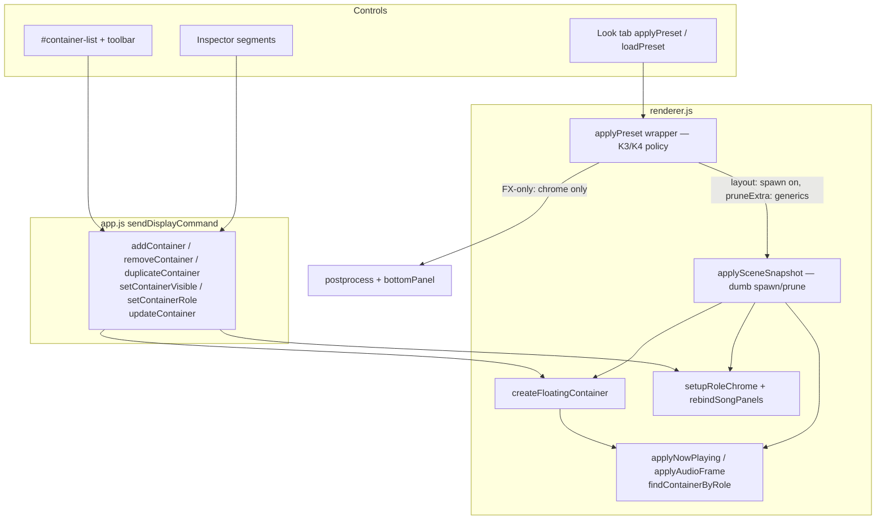
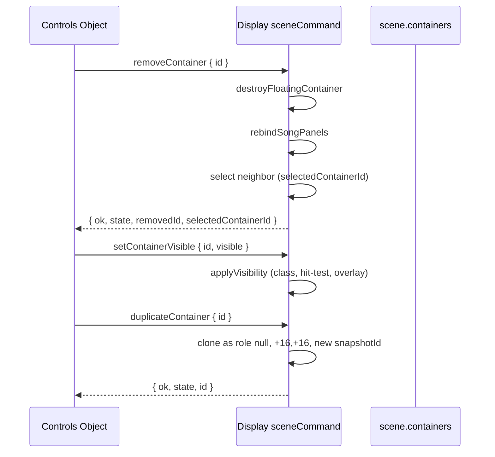

# Floating container management overhaul (Controls)

**Status:** Implemented (v1 in tree)  
**Author:** music_view  
**Date:** 2026-08-13  
**Location:** `docs/roadmap/container-management-plan.md`  
**Target app:** music_view (this repo)  
**Depends on:** Display scene (`renderer.js` `createFloatingContainer` / `destroyFloatingContainer` / `rebindSongPanels` / `applySceneSnapshot` / `applyScenePreset` / `exportScenePreset`), Controls Object tab (`controls.html` / `controls.js`), command hub (`app.js`, `preload.js`)  
**Related:** [scene-model.md](../architecture/scene-model.md) · [containers.md](../authoring/containers.md) · [presets.md](../authoring/presets.md) · [commands.md](../reference/commands.md) · [performance-timeline-plan.md](./performance-timeline-plan.md)

---

## Overview

Controls can only **edit** the eight boot-created unique-role panels. There is no first-class way to add a text/shader/image box, delete Lyrics, hide Scope for A/B, or persist a custom panel set through a look load. Performance snapshots already spawn/prune unique roles via `applySceneSnapshot`; Controls `applyPreset` / `loadPreset` still call `applyScenePreset`, which matches by role-then-id and **skips unknown extras**.

This plan makes the Object tab a **panel manager**: a scrollable list plus the existing inspector, with Add / Duplicate / Delete / Hide, a role dropdown, and look apply that can **add listed panels and remove extras the user added**. Extra panels are generic. Named music/viz roles remain unique (at most one each) and are **never auto-deleted** because an old preset omitted them. Runtime `id` stays session-local; persist `snapshotId` (UUID) so generics survive save/load.

---

## Background & Motivation

### Current state (verified in tree)

| Concern | Today |
|---------|--------|
| Boot | `renderer.js` IIFE calls `createSongInfoPanels` + `createAudioVizPanels` then `loadAndApplyPreset("default")`. Fixed eight: `song-cover`, `song-info`, `song-lyrics`, `song-progress`, `audio-scope`, `audio-history`, `audio-beat`, `artef4kt`. |
| Identity | Runtime `id` = `scene.nextContainerId++` (session integer). `snapshotId` exists on state / `getContainerSnapshot` / `exportScenePreset` but is usually `null` until Performance `exportPerformanceSnapshot` / `mintSnapshotId`. |
| Destroy / rebind | `destroyFloatingContainer(state)` and `rebindSongPanels()` exist (Performance PR). Destroy stops wander, tears down container FX + ARTEF4KT + shader, removes the DOM node, splices `scene.containers`, nulls `scene.songPanels.*` if matching. |
| Placement | `createFloatingContainer(..., { skipPlacementSearch })` already honors stored pixels when true; otherwise up to 30 `isPositionAllowed` nudges. Hidden boxes still occupy their rect for `isPositionAllowed` (opacity does not collapse layout). |
| Controls apply | `applyPreset` / `loadAndApplyPreset` → **`applyScenePreset` only**. Match: `findContainerByRole(entry.role)` then `findContainerById(entry.id)`. Unknown extras: `// Unknown extra container — skip`. No spawn, no prune. |
| Snapshot apply | `applySceneSnapshot` matches unique role → **any** unused live with that `snapshotId` → leftover **null-role** order; spawn/prune flags; then **re-calls `applyScenePreset`** (independent rematch by role/id); then prune leftovers; `rebindSongPanels` + `flushNowPlaying`. Command defaults: `spawnMissing` / `pruneExtra` **on** (`payload?.… !== false`). |
| Spawn gap | `spawnSnapshotContainer` **returns `null` unless `UNIQUE_SNAPSHOT_ROLES.has(entry.role)`**. Generics cannot spawn. Combined with rematch-by-id, even a forced generic spawn would not receive style/shader from `applyScenePreset`. |
| Export | `exportScenePreset` writes pixels + `relative` (or `null`) + `snapshotId` (often null). **Does not write `text`.** No `visible`. `exportPerformanceSnapshot` mints missing ids on **entries**, then write-back to live only via `liveByRole` — generics never receive the minted id on `state`. |
| Object tab | `#container-select` dropdown + inspector (`controls.html` ~183). Segments Transform / Style / Motion / Shader / Engine / FX unchanged. `updateContainer` live apply. `applyRoleFieldVisibility`. `[` `]` cycle. **No add / remove / hide / duplicate / role change.** |
| Content bind | `applyNowPlaying` / lyrics / progress use `scene.songPanels.*`. `applyAudioFrame` uses `findContainerByRole` for the three viz roles. Missing role ⇒ content has nowhere to draw (already true if bind is null). |
| Shader filter | `controls.js` `shadersForRole(role)` keeps packages whose `roles` include that **string** or `'any'`, or have no `roles`. `shadersForRole(null)` **excludes** every `["container"]` package. |
| FX-only looks | **69** `look-*` / `toolkit-*` files have **no `scene.containers` key**. `presets.js` `summarizePreset` marks `fxOnly` when `layers.length > 0 && containers.length === 0` (missing key ⇒ `[]`). Controls status already says “FX only — layout kept”. |
| Layout looks (actual counts) | **`default.json` = 7** (four song + three viz; **no `artef4kt`**). **Classics = 4** song roles only (`breathing-crt`, `night-cinema`, `gameboy-pocket`, `led-marquee`, `phosphor-terminal`, `thermal-ops`, `vhs-rental`, `test-look`). **Only `testing_fx.json` lists all 8.** None of these carry `snapshotId`. They were authored under “style the panels you know; leave the rest.” |
| Performance morph (code, not plan) | `applySceneTransition` morph (`renderer.js` ~6097–6176) lerps **matched** geometry + border color, freezes `includeInFloatArea`, commits with `applySceneSnapshot` at `u >= 1`. It does **not** fade unmatched in/out (no `fadeUnmatched`; extras vanish at commit) and does **not** step discrete fields at `u >= 0.5` (those rules live only in [performance-timeline-plan.md](./performance-timeline-plan.md) ~521–536). `AUTHORING_COMMANDS` includes `applyPreset` / `loadPreset` so a Controls look load emits `scene-user-edit`. |

### Pain points

1. The stage is a closed set of eight. Decorative text, extra shader fills, and temporary image boxes require code changes.
2. Deleting Lyrics (or any named role) is impossible; hiding a viz for a look is a style hack, not a first-class flag.
3. User-added extras (once we can add them) are **silently dropped** by look load (`applyScenePreset` skip). Naïve `pruneExtra: true` on Controls apply is worse: `default.json` would destroy boot ARTEF4KT; Night Cinema would destroy viz + ARTEF4KT; FX-only `look-*` would destroy everything.
4. `spawnSnapshotContainer` + rematch-by-id cannot host generics even though `matchSnapshotEntries` already understands `snapshotId`.
5. Duplicate-as-role would violate uniqueness; there is no factory that clones chrome as generic.

---

## Goals & Non-Goals

### Goals

| Goal | Success look |
|------|----------------|
| **A. Manage panels from Controls** | Object tab lists every live container; user can add, duplicate, delete, hide, and select from list or stage. |
| **B. Unique named + unlimited generic** | At most one of each of the eight named roles. Extra panels are generic (`role: null`) — text, shader fill, or empty image box. |
| **C. Honest look apply (compat)** | Loading a **layout** preset updates/spawns **listed** panels and **prunes generic extras** the user added. Unique roles omitted from an old file **stay**. FX-only looks do not touch the panel set. |
| **D. Stable generic identity** | Every container gets a `snapshotId` UUID on create and on export. Apply matches unique role (same role only) → generic `snapshotId` → leftover generic order. |
| **E. Role is editable** | Inspector can retarget a panel to a vacant named role or strip a named role to generic. Reject collisions. |
| **F. Additive commands** | New Display commands for spawn/destroy/duplicate/visible/role. Do **not** overload `updateContainer` for create. |
| **G. Shared destroy/rebind/snapshot** | Same `destroyFloatingContainer` / `rebindSongPanels` / `applySceneSnapshot` engine. Hidden participates in morph via K16 (PR 5), using opacity-only CSS. |

### Non-goals (v1)

- Undo / redo stack (stays [backlog](./backlog.md)).
- On-canvas create-by-click or place-then-drag spawn (user chose list + inspector).
- Nested containers / groups / multi-select.
- Arbitrary new Music-driven roles without engine support (`applyNowPlaying` / `applyAudioFrame` stay role-wired).
- User file picker for image panels (v1 = empty box / color fill; `imageSrc` later).
- Migrating all checked-in `look-*` files to include a baked 8-panel layout.
- Migrating classics / `default.json` to a full 8-role list (compat prune makes this unnecessary).
- Persisting an **empty stage** as a look (`containers: []` is FX-only, same as omitted — K4).
- Changing boot: still seed the eight unique roles, then apply `default`.
- A Controls-side scene graph or splitting `renderer.js` (out of scope except small extracts).
- Implementing the full Performance-plan discrete-0.5 / unmatched-fade matrix except the K16 `visible` rule in PR 5.

---

## Key Decisions

Locked product calls plus implementation defaults proven by the current code. Treat these as final unless a later review explicitly reopens them.

**User locks (do not reopen):** (1) one of each named role + unlimited generic; (2) look load can add listed panels and remove extras the user added; (3) Object tab = list + inspector.

| # | Decision | Rationale |
|---|----------|-----------|
| K1 | **At most one of each named role.** Roles: `song-cover`, `song-info`, `song-lyrics`, `song-progress`, `audio-scope`, `audio-history`, `audio-beat`, `artef4kt`. Extra panels are generic (`role: null`). | Music/viz bind by role (`findContainerByRole`, `scene.songPanels`). A second Lyrics has nowhere well-defined to attach. |
| K2 | **Deleting a named role is allowed** (manual only). That content has nowhere to draw until the user adds the role again. Controls look apply **never** auto-deletes a unique role. | Same as a missing bind today. Confirm in UI (K12). |
| K3 | **Controls layout apply = spawn listed + prune generics only.** `applyPreset` / `loadPreset` / `loadAndApplyPreset` (when `containers[]` is non-empty): **one** `applySceneSnapshot({ spawnMissing: true, pruneExtra: 'generics' })`. Never pass `pruneExtra: true` / `'all'` from Controls. Performance still uses `pruneExtra: true` (all unmatched, including unique roles). | Honors lock 2 without wiping ARTEF4KT/viz that old files never listed. One match, one `keepSet`, correct `removed`. |
| K4 | **Caller policy on Controls apply only.** Missing `containers` key, non-array, **or** `containers: []` → apply postprocess + `bottomPanel` only; **do not** call `applySceneSnapshot` with prune. `applySceneSnapshot` stays a dumb spawn/prune engine (Performance always spawn/prune **all**, including unique roles). | 69 look/toolkit files omit the key. `[]` cannot mean empty stage (would collide with FX-only export). Empty stage is not a look. |
| K5 | **Match order (tightened):** (1) unique-role entry pairs **only** with a live container that **still has that role**; (2) else generic entry ↔ unused live generic by `snapshotId`; (3) leftover unused generics by array order. **Never** pair a unique-role entry with a generic via `snapshotId`. Runtime `id` is never the persistence key. | Today’s `matchSnapshotEntries` snapshotId fallthrough would steal a demoted Cover and never spawn. `scene-match.js` has no leftover-generic pass — do not claim they are identical. |
| K6 | **Mint `snapshotId` on create and on export** if missing. Write it from `exportScenePreset`. Write minted ids **back to live** by export-array order (not only `liveByRole`). Generics **must** have one. | `exportPerformanceSnapshot` today remints generics every capture. |
| K7 | **Do not silently spawn via `updateContainer`.** New commands: `addContainer`, `removeContainer`, `duplicateContainer`, `setContainerVisible`, `setContainerRole`. | Additive-command practice. |
| K8 | **`spawnSnapshotContainer` coerces role.** If `UNIQUE_SNAPSHOT_ROLES.has(entry.role)`, spawn **with that role** and run role chrome (`setupRoleChrome` / song class + `setupSong*` / artef4kt mount). If role is null or unknown, spawn generic (`role: null`). Drop the early return that refused generics. `applyPresetEntryToState` still **must not** overwrite `role` on an already-matched live panel. | Lyrics listed in a file and missing live must come back as Lyrics, not a blank generic. |
| K9 | **`applySceneSnapshot` applies already-matched pairs.** Extract `applyPresetEntryToState(state, entry)`. **Do not** call `applyScenePreset`’s role/id matcher. | After spawn, a generic has a new runtime `id`. |
| K10 | **Object tab = stacked list + inspector** (Controls ~380px). Toolbar + `#container-list` + existing segments. Replace `#container-select`. | User lock 3. |
| K11 | **Duplicate always yields generic.** Copy style/shader/geometry; offset +16,+16; new `snapshotId`; `role: null`. Never duplicate a unique role. | Uniqueness. |
| K12 | **Confirm delete of a named role** via `window.confirm` in Controls (same as `performance.js`). Copy: “Lyrics will disappear until you add a Lyrics panel.” Generic delete: **no confirm**. | Destructive + content loss. |
| K13 | **Hide is `visible: false` (default true).** CSS: `.floating-box.is-hidden { opacity: 0; pointer-events: none; }` — **no `visibility: hidden`**, **no `display: none`**. Layout size stays so shaders/ARTEF4KT keep a non-zero canvas and distancing still sees the box. Overlay label skipped. Still in the list and in presets. | `visibility: hidden` cannot fade (K16). `display: none` zeros `clientWidth`. |
| K14 | **Role change** via `setContainerRole`. Target unique role already on stage → `{ ok: false, error }`. Named → generic allowed. Generic → vacant named allowed, then `setupRoleChrome` + `rebindSongPanels`. | Inspector dropdown. |
| K15 | **Default spawn:** centered-ish in the float area (`getFloatAreaSize`), `skipPlacementSearch: false` so distancing can nudge (hidden boxes still occupy space), `layer = max(existing.layer)+1`, fresh `snapshotId`. Soft cap **32** live containers. | Avoid stacking on cover. |
| K16 | **Hidden morph (PR 5).** Do **not** step `visible` at `u = 0.5`. Do **not** call `applyContainerVisibility` mid-lerp. Drive `element.style.opacity` only during `sceneTransition`. Matrix: both visible → existing geometry morph; both hidden → stay at 0; out hidden / in visible → stay at 0 until commit, then tween `element.style.opacity` **0→1 over a fixed 180ms** and clear the inline opacity (do **not** use `min(remaining, 180ms)` — remaining is 0 at commit); out visible / in hidden → fade opacity to 0 over the morph interval, commit `visible: false`. Unmatched fade (spawn 0→1 / extra 1→0) is **in the same PR** if cheap; otherwise extras still vanish at Performance commit (today). | Avoids mid-morph flash. Owned by PR 5, not a later maybe. |
| K17 | **Export and apply `text` for non-song panels.** Song roles ignore in-box `text` on apply (lyrics/info DOM win). | `exportScenePreset` and `applyScenePreset` both drop `text` today. |
| K18 | **Boot stays 8 + `default`.** `loadAndApplyPreset("default")` uses K3/K4 (spawn listed 7, prune generics only) so boot ARTEF4KT **survives**. Do **not** require rewriting `default.json` to 8. | Least surprise on launch. |

---

## Proposed Design

### Architecture



### Identity

```
live container
  id            integer, session-local, never persisted as a match key
  snapshotId    UUID string, minted on create / clone / export-if-missing
  role          named unique string | null
  visible       boolean, default true
```

Apply matching (`matchSnapshotEntries` — **change from today**):

1. If `entry.role` is in `UNIQUE_SNAPSHOT_ROLES`, take the unused live container with **that same role**. If none, leave unmatched → spawn (K8). **Do not** fall through to snapshotId on a generic that used to be this role.
2. Else if `entry.snapshotId`, take the unused live **generic** (`!c.role`) with that id.
3. Else take the next unused live generic in array order.
4. Else unmatched → spawn if `spawnMissing`, else skip. Spawn **coerces** `entry.role` (K8): unique listed role ⇒ new live container **with that role** + role chrome; null/unknown ⇒ generic. Lyrics in a file cannot spawn as a blank.

Do **not** match leftover named-role live panels to generic entries.

`scene-match.js` `matchContainers` is unique role → snapshotId with **no** leftover-generic pass. This work does **not** have to change the Performance `auto` scorer; after extras exist, Jaccard/fill can under-pair generics (accept; recapture still works by `snapshotId` on the snapshot apply path).

### Add templates

Add menu (`+ Add ▾`) lists:

| Template | `role` | Default content | Default size |
|----------|--------|-----------------|--------------|
| Blank | `null` | empty `text`; `kind` hint `blank` | 160×100 |
| Text panel | `null` | `text: "Text"` | 200×80 |
| Shader panel | `null` | v1: add blank, switch Object segment to Shader. Optional `shaderId` if provided and it passes the container-package filter | 220×130 |
| Image panel | `null` | empty box, `imageMode: "fill"`, persist `panelKind: "image"` so the chip is not “blank” | 180×180 |
| Cover | `song-cover` | role chrome; disabled if present | cover-like square ~48% min side |
| Track / Info | `song-info` | `setupSongInfoBlock` + last now-playing | 160×72 |
| Lyrics | `song-lyrics` | `setupSongLyricsBlock` + last lyric focus | ~78% panel width × 110 |
| Progress | `song-progress` | `setupSongProgressBar` | ~84% × 28 |
| Scope / History / Beat | viz roles | default packages as in `createAudioVizPanels` (`audio-scope`, `audio-history`, `audio-ferrofluid`) | viz defaults |
| ARTEF4KT | `artef4kt` | `embed` + `mountArtef4ktOnContainer` | ~180–420 square |

Named-role items are **omitted or disabled** when that role is already on stage.

**Shader package filter** (never `shadersForRole(null)`):

```js
function shadersForContainerFill(list) {
  return (list || []).filter((s) => {
    const roles = s.roles;
    if (!roles || !roles.length) return true;
    return roles.includes('container') || roles.includes('any');
  });
}
```

If `addContainer` receives `shaderId`, validate with this filter and fail closed (`Unknown or non-container shader`).

**Soft cap:** `scene.containers.length >= 32` → `{ ok: false, error: 'Container limit (32)' }` on `addContainer`, `duplicateContainer`, and snapshot spawn of extras (unique-role spawn to restore a listed role still allowed).

Spawn implementation: `addContainer` → `createFloatingContainer` with template defaults (no shader load in create if `applyPresetEntryToState` will apply it — for interactive add, create may load `shaderId` **once**) → `setupRoleChrome(state)` → `rebindSongPanels()` → `flushNowPlaying` if a song role was added → `setSelectedContainerId(newId)` → `publishSceneState`.

### Remove / hide / duplicate



- **Delete:** `destroyFloatingContainer` + `rebindSongPanels`. **Display owns selection:** set `selectedContainerId` to previous neighbor (or next if first); if last panel, `null`. Return `{ removedId, state }` (`state.selectedContainerId` is the source of truth). Controls only `applyState`.
- **Hide:** `state.visible = !!visible`; `applyContainerVisibility(state)`. `drawContainerLabel` returns early if `visible === false` (today it only checks `labelEnabled`). `setupContainerDragResize` pointerdown ignores hidden even though CSS `pointer-events: none` should already drop hits. Hidden panels remain selectable from the list. Hidden boxes **still occupy** their rect for `isPositionAllowed` / distancing (Add will not stack under an invisible panel unless you disable distancing).
- **Duplicate:** create a **new** container (do not clone the DOM). Copy style, shader, uniforms, modulators, container FX, geometry. Force `role: null`, new `snapshotId`, `layer = max+1`, offset +16,+16, clamp. **Do not** copy `embed` / ARTEF4KT host (artef4kt clone → blank generic of the same size). `cloneId` is **not** accepted on `addContainer` once `duplicateContainer` exists.

### Role chrome

Extract from `createSongInfoPanels` / `createAudioVizPanels` / `rebindSongPanels`. `rebindSongPanels` only **adds** chrome on new elements; it never removes it. Leaving song roles without restoring `.floating-text` leaves a generic that cannot show `text`.

```js
function roleTaken(role, exceptId) {
  if (!role || !UNIQUE_SNAPSHOT_ROLES.has(role)) return false;
  return scene.containers.some((c) => c.role === role && c.id !== exceptId);
}

async function setupRoleChrome(state, prevRole = null) {
  // teardown prevRole per table, assign state.role, mount new chrome, rebind + flush
}
```

**Teardown / keep table** (PR 2 done-when):

| Leaving | Remove | Keep |
|---------|--------|------|
| `song-info` / `song-lyrics` / `song-progress` | Role class (`SONG_ROLE_CLASS`), injected song DOM (`.song-info-block`, `.song-lyrics-viewport`, progress canvas); restore `.floating-text` `display` + `textEl` | style, geometry, `snapshotId` |
| `song-cover` | Role class; **clear** `image` / `imageSrc` so a demoted cover is not a stuck bitmap | style, geometry |
| `audio-*` | Role only (bind drops via `findContainerByRole`) | current `shaderId` / uniforms (decorative fill) |
| `artef4kt` | `unmountArtef4ktFromContainer`, clear `embed` | size, style |
| generic | nothing role-specific | — |

**Entering:**

| Entering | Action |
|----------|--------|
| `song-*` | Add role class; `setupSong*`; `flushNowPlaying` / last lyric / last progress |
| `audio-*` | Install default viz package **only if** `!state.shaderId` |
| `artef4kt` | `clearShader` if any; `mountArtef4ktOnContainer` |
| generic | Ensure `.floating-text` visible if no shader |

### applyPreset vs applySceneSnapshot

**K4/K3 live only in the Controls preset wrapper.** `applySceneSnapshot` does not know about FX-only files.

```mermaid
flowchart TD
  A["applyPreset / loadAndApplyPreset"] --> B{"containers key present and length > 0?"}
  B -->|no — omitted, non-array, or []| C["apply postprocess + bottomPanel only\nfxOnly: true — do not call applySceneSnapshot"]
  B -->|yes — layout look| D["applySceneSnapshot spawnMissing true, pruneExtra: generics"]
  D --> E["matchSnapshotEntries — K5"]
  E --> F["spawn unmatched listed — unique role stays unique"]
  F --> G["for each pair: applyPresetEntryToState once\n(does not overwrite role)"]
  G --> H["apply global postprocess"]
  H --> I["destroy unmatched generics only\nsame keepSet; unique leftovers stay"]
  I --> J["rebindSongPanels + flushNowPlaying"]
  J --> K["return { added, removed, kept, fxOnly: false, state }"]
```

**`hasLayoutContainers(sceneData)`:** `Array.isArray(sceneData.containers) && sceneData.containers.length > 0`.

**`applySceneChromeOnly(preset)`:** today’s postprocess + `bottomPanel` half of `applyScenePreset` (extract). Used by the FX-only branch. **Must not** pass `pruneExtra: true` with `containers: []`.

**`applyPresetEntryToState(state, entry)`:** geometry, style, wander, **`text` (non-song only)**, **`visible`**, shader, embed, container FX, `snapshotId`, `relative`. Does **not** assign or overwrite `role` on an already-matched live panel (role changes go through `setupRoleChrome` / spawn). If `entry.role` is unique and `state.role` already matches, leave chrome.

**`spawnSnapshotContainer(entry)` (PR 1 — restore unique roles, also spawn generics):**

```js
const role = UNIQUE_SNAPSHOT_ROLES.has(entry.role) ? entry.role : null;
// createFloatingContainer({
//   role, text, visible, snapshotId, skipPlacementSearch: true,
//   left/top/width/height, label, layer, style,
//   /* no shaderId — apply once in applyPresetEntryToState */
// })
// then setupRoleChrome(state) so song-lyrics / artef4kt / viz classes exist
```

Unique listed + missing live ⇒ spawn **with that role** (Delete Lyrics, then load `default` / a 4-role classic → `findContainerByRole('song-lyrics')` is non-null). Null/unknown ⇒ generic.

**`applySceneSnapshot` (dumb engine):**

- Flags: `spawnMissing` (boolean), `pruneExtra`: `true` \| `false` \| `'generics'`. Command `applySceneSnapshot` defaults `spawnMissing`/`pruneExtra` **on** (`!== false` and not the string `'generics'` → `true`) so Performance is unchanged.
- Match (K5) → spawn missing (K8 coerce) → apply pairs via `applyPresetEntryToState` → global PP → prune from the **same** `keepSet` (`pairs.map(p => p.state)`):
  - `pruneExtra === true` — destroy **all** unmatched (unique roles included). Performance.
  - `pruneExtra === 'generics'` — destroy unmatched **`!c.role` only**. Omitted unique roles stay. Controls.
  - `pruneExtra === false` — destroy nothing.
- **Does not** call `applyScenePreset`. Wrapper must **not** re-run `matchSnapshotEntries` or a second prune helper.
- Returns `{ state, added, removed, kept }` where `added` = spawned count, `removed` = destroyed count (includes generic prune when `'generics'`), `kept` = matched live count.
- Spawn creates chrome + geometry + `snapshotId` / `visible` / `text` + **coerced role**. **Do not** pass `shaderId` into `createFloatingContainer` on this path. Shader / embed / FX apply **once** in `applyPresetEntryToState`.

**`applyScenePreset`:** leave callable for any leftover skip-unknown caller. Snapshot path **must not** use its matcher. Prefer extracting chrome apply so both share postprocess/bottomPanel without sharing the container loop.

**Status (Controls `loadSelectedPreset`):**

```js
if (result.fxOnly) {
  setStatus(`Loaded “${label}” (FX only — layout kept)`, 'ok');
} else if (result.added || result.removed) {
  setStatus(`Look applied — ${result.added} panels added, ${result.removed} removed.`, 'ok');
} else {
  setStatus(`Loaded “${label}”`, 'ok');
}
```

**Save then re-apply** (`saveCurrentAsPreset` already calls `applyPreset`): identity no-op if snapshotIds match; counts 0/0.

**Empty stage:** if the user deletes every panel and Save, export writes `containers: []`. Re-apply is FX-only and keeps whatever is live. **Accepted limitation** (K4). Look files must **omit** the key, never write `[]`, if they are FX-only (current look-* already omit).

### List UI

Replace the Object tab header in `controls.html`:

```html
<section class="panel">
  <div class="section-head">
    <h2>Panels</h2>
    <div class="obj-toolbar">
      <div class="btn-menu-wrap">
        <button type="button" id="container-add" class="btn">+ Add</button>
        <div id="container-add-menu" class="btn-menu hidden" role="menu">…templates…</div>
      </div>
      <button type="button" id="container-dup" class="btn" title="Duplicate as generic">Dup</button>
      <button type="button" id="container-del" class="btn danger" title="Delete panel">Del</button>
    </div>
  </div>
  <div id="container-list" class="container-list" role="listbox" aria-label="Floating panels"></div>
  <p id="container-list-empty" class="hint hidden">No panels — Add one.</p>
  <div id="container-editor" class="container-editor hidden">
    <!-- existing segments; add role <select id="c-role"> in Transform -->
  </div>
</section>
```

Row (mirror FX layer rows: compact, eye, name, chip):

```
[◉]  Cover              song-cover
[○]  Notes              text        ← hidden
[◉]  Scope              audio-scope
```

**Generic chip classifier** (no new required schema beyond optional `panelKind`):

| Chip | When |
|------|------|
| `text` | `text` non-empty and no `shaderId` |
| `shader` | `shaderId` set |
| `image` | `panelKind === 'image'` **or** (`imageMode === 'fill'` && !text && !shaderId && `hasImage`) |
| `blank` | else |

Image template writes `panelKind: "image"` on create so an empty image box is not `blank`. Export `panelKind` when not null (additive).

- Eye toggles `setContainerVisible` (stopPropagation). Eye can ship in PR 5; PR 4 list may show a static eye until then.
- Click row → `selectContainer` + `renderContainerEditor`.
- Selected row highlight (reuse `.pp-layer-row.selected` density).
- Hidden row: muted (`.disabled` / `.is-hidden`).
- `[` `]` cycle **all** panels including hidden. Stop reading `#container-select`.

`renderContainerSelect` → `renderContainerList`. `applyRemoteContainerSelection` / `applyState` update the list highlight instead of `$('container-select').value`.

Inspector: keep Transform / Style / Motion / Shader / Engine / FX. Add **Role** `<select id="c-role">` on Transform. Occupied unique roles disabled except the current one. Changing role calls `setContainerRole`, not `updateContainer`.

### Visibility implementation

```js
function applyContainerVisibility(state) {
  const on = state.visible !== false;
  state.visible = on;
  const el = state.element;
  if (!el) return;
  el.classList.toggle("is-hidden", !on);
  if (!sceneTransition) el.style.opacity = ""; // let CSS class win; morph owns inline opacity
  el.setAttribute("aria-hidden", on ? "false" : "true");
}

// main.css — PR 1
.floating-box.is-hidden {
  opacity: 0;
  pointer-events: none;
}
```

During `sceneTransition` (PR 5): do not toggle `.is-hidden` until commit; set `el.style.opacity` each frame. Hidden→visible: after snapshot commit, tween opacity **0→1 over a fixed 180ms**, then clear the inline opacity (never `min(remaining, 180ms)`). Visible→hidden: fade to 0 over the morph, then add `.is-hidden` and clear the inline opacity.

`getContainerSnapshot` / `exportScenePreset` include `visible: state.visible !== false`. Missing field on apply ⇒ true.

Hidden shaders may keep running (v1). Overlay: `drawContainerLabel` early-out if `!state.visible`.

### Performance

No conductor change required.

- Live extras appear in `exportSceneSnapshot` / captures.
- `applySceneSnapshot` (Performance) still `spawnMissing` + `pruneExtra: true` — **full** prune, including unique roles the snapshot omitted. That is how a show restores “user deleted Lyrics.” Controls looks use `pruneExtra: 'generics'` (same function, different flag).
- Controls look load during a show remains an `AUTHORING_COMMANDS` edit (`applyPreset` / `loadPreset` already listed). After this ships it can **add listed panels and remove generic extras**. Recapture if the cue should keep that stage. Do not special-case it off (would reopen K3).
- New five commands join `AUTHORING_COMMANDS`.
- Morph `visible`: K16, implemented in **PR 5**.
- `exportPerformanceSnapshot` write-back: pair entries to `scene.containers` in export order (same order `exportScenePreset` walks), mint onto both entry and `state`. Not `liveByRole` only.

---

## API / Interface Changes

### New Display commands

Handled in `renderer.js` `sceneCommandDispatch`. Forwarded unchanged by existing `sendCommand` / `control-command`. Add all five to `AUTHORING_COMMANDS`.

**`addContainer` precedence:** `role` (if unique and listed) wins over `template`; if both `template` and `role` are set and they disagree → `{ ok: false, error: 'template/role mismatch' }`. Do **not** accept `cloneId` (use `duplicateContainer`).

| Command | Payload | Result | Notes |
|---------|---------|--------|-------|
| `addContainer` | `{ template?: 'blank'\|'text'\|'shader'\|'image'\| named-role, role?: string, shaderId?, left?, top?, width?, height?, label?, text? }` | `{ ok, id, state }` or `{ ok: false, error }` | Reject unique-role collision. Cap 32. |
| `removeContainer` | `{ id }` | `{ ok, state, removedId }` | Display selects neighbor. `state.selectedContainerId` is the new selection. |
| `duplicateContainer` | `{ id }` | `{ ok, id, state }` | Always generic. Cap 32. |
| `setContainerVisible` | `{ id, visible }` | `{ ok, state }` | |
| `setContainerRole` | `{ id, role }` | `{ ok, state }` or `{ ok: false, error }` | `role: null` or `""` ⇒ generic. Enforce uniqueness. |

Errors: `'Container not found'`, `'Role already exists: song-lyrics'`, `'Unknown template'`, `'template/role mismatch'`, `'Container limit (32)'`, `'Unknown or non-container shader'`.

### Existing commands — behavior change

| Command | Before | After |
|---------|--------|-------|
| `applyPreset` | `applyScenePreset` (skip extras) | K4 chrome-only **or** `applySceneSnapshot({ spawnMissing: true, pruneExtra: 'generics' })`. Return `{ added, removed, kept, fxOnly, state, activePreset }`. |
| `loadPreset` / `loadAndApplyPreset` | `applyScenePreset`; return `{ ok, name, state }` | Same wrapper as `applyPreset`; pass through counts + `fxOnly`. |
| `applySceneSnapshot` | Spawn unique roles only; rematch via `applyScenePreset`; return `getSceneState()` | Spawn with K8 role coerce; K5 match; apply pairs; `pruneExtra`: `true` \| `false` \| `'generics'`; honor `visible`; return `{ state, added, removed, kept }`. Command still defaults spawn/prune **on** (`true`). |
| `exportPreset` / `exportScenePreset` | `snapshotId` often null; no `text`; no `visible` | Mint + write-back; write `text` (non-song); write `visible`; write `panelKind` if set. |
| `exportSceneSnapshot` | `liveByRole` write-back | Array-order write-back so generics keep ids. |
| `updateContainer` | Field patch | Accept `visible`. **Reject `role`** (force `setContainerRole`). No spawn. |
| `selectContainer` | Unchanged | Hidden panels selectable from the list. |

### Controls IPC usage

```js
await cmd('addContainer', { template: 'text' });
await cmd('addContainer', { template: 'shader', shaderId: 'plasma' });
await cmd('addContainer', { role: 'song-lyrics' });
await cmd('duplicateContainer', { id: selectedId });
await cmd('removeContainer', { id: selectedId });
await cmd('setContainerVisible', { id, visible: false });
await cmd('setContainerRole', { id, role: 'audio-scope' });
```

---

## Data Model Changes

### Container snapshot / preset entry (additive)

```json
{
  "snapshotId": "8f3c0a2e-…",
  "role": null,
  "visible": true,
  "panelKind": "image",
  "text": "Notes",
  "label": "Notes",
  "left": 120,
  "top": 400,
  "width": 200,
  "height": 80,
  "relative": null,
  "shaderId": null,
  "shaderUniforms": {},
  "style": {}
}
```

| Field | Default if omitted | Notes |
|-------|--------------------|-------|
| `snapshotId` | mint on apply/export | Required for generics to round-trip |
| `visible` | `true` | New |
| `text` | `""` | Exported/applied for non-song panels |
| `role` | `null` | Unknown strings coerce to `null` on spawn |
| `panelKind` | omit | `'image'` for Image template chip |

No preset envelope version bump (`version` stays 1). Additive fields only.

### Migration

- **`default.json` (7 roles, no artef4kt):** update listed 7; boot ARTEF4KT stays; user generics pruned. No file rewrite required.
- **Classics (4 song roles):** restyle the four song panels; viz + ARTEF4KT stay; user generics pruned.
- **`testing_fx.json` (8):** update all eight; prune generics only.
- **FX-only `look-*` / `toolkit-*` (no key):** chrome only; entire panel set stays.
- **User save after this ships:** has `snapshotId` on every panel; generics round-trip; unique roles still never auto-deleted by Controls apply.
- **Performance snapshots:** full spawn/prune including unique roles (unchanged engine flags).
- **No file rewrite** of checked-in presets required for v1.

---

## Alternatives Considered

### 1. Unlimited instances of named roles

Allow two Lyrics panels, bind Music to the first `findContainerByRole`.

- **Pros:** Simpler uniqueness rules.
- **Cons:** Second panel is a zombie. `scene.songPanels` is singular.
- **Rejected.** Unique named + generic extras is lock 1.

### 2. Full `pruneExtra: true` on Controls apply (literal lock 2)

- **Pros:** Look file is the entire stage.
- **Cons:** `default.json` deletes ARTEF4KT on every launch; Night Cinema deletes viz + ARTEF4KT; contradicts “boot stays 8.”
- **Rejected.** K3 prune = generics only. User can still Delete a unique role by hand.

### 3. `containers: []` means empty stage

- **Pros:** Empty layout becomes persistable.
- **Cons:** Indistinguishable from a mistaken FX-only write; look-* must never write `[]` (they omit the key today, but a future exporter could slip).
- **Rejected for v1 (K4).** Empty stage is not a look. Manual delete still works in-session.

### 4. Click-to-place on the Display stage

- **Pros:** Faster spatial authoring.
- **Cons:** User chose list + inspector.
- **Deferred.**

### 5. Overload `updateContainer` with `{ create: true }`

- **Rejected** (K7).

### 6. `display: none` or `visibility: hidden` for hide

- **Rejected.** `display: none` zeros canvases. `visibility: hidden` cannot fade (K16). Opacity + `pointer-events: none` only (K13).

---

## Security & Privacy Considerations

| Threat | Severity | Mitigation |
|--------|----------|------------|
| Image template later loading `file://` or remote URLs | Medium | v1 has no user file. When added: reuse `setContainerImageFromUrl` constraints. |
| Preset JSON with huge `text` / many extras | Low | Cap 32 containers; `text` length recommend 2k on apply. |
| Unknown `role` strings | Low | Coerce to generic (K8). |
| `shaderId` on add | Low | Container-package filter; fail closed. |
| Confirm-less generic delete | Low | Session-only until save; named-role `window.confirm`. |

No new network, no new privileges, no change to Music/library paths.

---

## Observability

### Logging

- `console.warn` already used for shader/ARTEF4KT apply failures — keep.
- Command failures return `{ ok: false, error }` (Controls `setStatus(..., 'error')`).

### Counts

`applySceneSnapshot` and the Controls preset wrapper return:

```js
{ ok: true, added, removed, kept, fxOnly, state }
```

`added` / `removed` default `0`; `fxOnly` only on the preset wrapper.

### QA signals

- After launch: **8** panels, `findContainerByRole('artef4kt')` non-null.
- After loading `default`: still 8 (ARTEF4KT kept); user generics gone.
- After loading `night-cinema` / `breathing-crt`: **viz + ARTEF4KT stay**; four song panels restyled; user generics gone.
- After loading `look-neon-bloom`: **panel set unchanged** (FX-only).
- After adding 2 generics then loading `default`: extras gone, 8 remain.

---

## Rollout Plan

No feature flag infrastructure. Ship behind incremental PRs; each is independently revertible.

### Rollback

- Revert Controls HTML/JS to restore `#container-select`.
- Revert the `applyPreset` wrapper alone if prune surprises authors.
- `visible` / `snapshotId` / `text` / `panelKind` in files are additive; old code ignores them.

### Manual QA

1. Launch → 8 boot panels; `findContainerByRole('artef4kt')` non-null after `default` apply.
2. Object list shows 8 rows; click stage selects row; `[` `]` cycle.
3. Add Text + Shader; both appear; save preset; reload app; both survive (`snapshotId`).
4. Hide Scope (eye); not hit-testable; still in list and still occupies distancing; unhide.
5. Delete Lyrics → `window.confirm` → lyrics gone; Music still plays; Add Lyrics → content returns.
6. Duplicate Cover → generic clone offset; still one `song-cover`.
7. Change generic → vacant `audio-beat` → live uniforms attach next frame; default ferro only if no `shaderId`.
8. Change Beat → generic → `applyAudioFrame` no longer finds beat; ferro **kept** as decorative fill.
9. Demote Cover → generic (bitmap cleared); load a snapshot that still lists `song-cover` with the old `snapshotId` → **new Cover spawns**; generic is **not** stolen / restyled as Cover.
10. Collision: set second panel to `song-cover` → error, no change.
11. Load `default` with extras on stage → extras pruned; ARTEF4KT stays; status “N added, M removed.”
12. Load `night-cinema` / `breathing-crt` → viz + ARTEF4KT stay.
13. Load `look-neon-bloom` → no prune; FX applied; status FX-only.
14. Save a scene after deleting all panels → `containers: []` → reload that look does **not** empty the stage (K4).
15. Performance capture after adding extras → extras in snapshot; Go/cut restores them; deleting Lyrics then capturing restores no-Lyrics (full prune on snapshot path).
16. Morph between snapshots that differ in `visible` follows K16 (no mid-flash); hide class is not applied mid-lerp.

---

## PR Plan

Incremental. Destroy/rebind/snapshot already exist — extend them.

### PR 1 — Snapshot spawn/apply can host generics

**Scope:** `renderer.js`, `main.css`.

- Extend `spawnSnapshotContainer` (K8): `const role = UNIQUE_SNAPSHOT_ROLES.has(entry.role) ? entry.role : null`. Unique missing roles spawn **with that role** + `setupRoleChrome`. Null/unknown spawn generic. Spawn: chrome + geometry + coerced `role` + `snapshotId`/`visible`/`text`. **No** `shaderId` into `createFloatingContainer` on this path.
- Extract `applyPresetEntryToState` (includes `text` for non-song, `visible`). **Does not overwrite `role`.** Shader/embed/FX applied **once** here.
- `applySceneSnapshot`: K5 match; apply **pairs**; **do not** call `applyScenePreset`’s matcher; `pruneExtra`: `true` (all unmatched) \| `false` \| `'generics'` (unmatched `!c.role` only), using the internal `keepSet`.
- Return `{ state, added, removed, kept }` (`removed` includes generic-only destroys).
- Mint `snapshotId` in `createFloatingContainer` if missing; mint on `exportScenePreset`; write back to live **by array order** (fix `exportPerformanceSnapshot`).
- Export `text` (non-song) and `visible`.
- `applyContainerVisibility` + `main.css` `.floating-box.is-hidden` (opacity + pointer-events only).
- `drawContainerLabel` early-out if `visible === false`.
- `applyContainerUpdates` accepts `visible`; **rejects `role`**.

**Done when:** a hand-built snapshot with 8 roles + 1 generic extra spawn/prunes correctly via `applySceneSnapshot` from the console; demote-Cover + snapshot Cover with same `snapshotId` **spawns** Cover (not stolen); **delete live Lyrics then `applySceneSnapshot` `default.json` / a 4-role classic → `findContainerByRole('song-lyrics')` is non-null**; `pruneExtra: 'generics'` leaves unmatched unique roles and removes unmatched generics (including ones the file did not list).

### PR 2 — Add / remove / duplicate / visible / role IPC

**Scope:** `renderer.js` `sceneCommandDispatch`, `AUTHORING_COMMANDS`, `docs/reference/commands.md`.

- Five commands (K7, K11, K14, K15). Cap 32. `addContainer` precedence as in the API table. No `cloneId`.
- `setupRoleChrome` + teardown table. `rebindSongPanels` reused.
- Unique-role collision errors.
- Template defaults. Shader filter for `shaderId`.
- `removeContainer` returns `{ removedId, state }` and Display selects neighbor.

**Done when:** console `addContainer({ template: 'text' })` works; remove/dup/role/visible work; leaving `song-info` restores `.floating-text`; leaving `audio-beat` keeps shader; leaving `song-cover` clears image; Music rebinds after adding Lyrics.

### PR 3 — Controls `applyPreset` spawn listed / prune generics

**Scope:** `applyPreset`, `loadAndApplyPreset` wrapper only (not `applySceneSnapshot` internals), Controls `loadSelectedPreset` status.

- K4: omitted / non-array / `[]` → `applySceneChromeOnly`; `fxOnly: true`.
- Layout: **only** `applySceneSnapshot({ spawnMissing: true, pruneExtra: 'generics' })`. No second match, no wrapper `keepSet`.
- Map `{ added, removed, kept, fxOnly }` through `loadAndApplyPreset`.
- Status else-chain (FX-only copy kept).

**Done when:**

| Load | Panels |
|------|--------|
| Launch / `default` | 8; ARTEF4KT present |
| `night-cinema` / `breathing-crt` | viz + ARTEF4KT stay; song 4 restyled; user generics gone |
| `look-neon-bloom` | set unchanged; FX applied |
| extras then `default` | extras gone; 8 remain |

### PR 4 — Object list UI

**Scope:** `controls.html`, `controls.css`, `controls.js`.

- Replace `#container-select` with toolbar + `#container-list` (K10).
- `renderContainerList`, selection sync, empty state, chip classifier.
- Wire Add / Dup / Del. **Named-role Del uses `window.confirm` here** (K12) so Del is safe before PR 5.
- `[` `]` cycle all rows.
- Keep inspector segments. Eye may be visual-only until PR 5.

**Done when:** list is the only picker; stage click still selects.

### PR 5 — Role change, hide, duplicate polish, K16 morph

**Scope:** Controls inspector + Display visibility + morph runner (`applySceneTransition` morph loop).

- `#c-role` + `setContainerRole`.
- Eye on rows → `setContainerVisible`.
- Duplicate offset visible on stage.
- `applyRoleFieldVisibility` after role change.
- **K16:** opacity-only during `sceneTransition`; no `.is-hidden` until commit; after commit, tween opacity **0→1 over a fixed 180ms** then clear inline opacity (not `min(remaining, 180ms)`); fade-out uses the morph interval; `applyContainerVisibility` not used mid-lerp. Optional unmatched fade in this PR if it stays small; otherwise leave extras-vanish-at-commit as today and only ship the `visible` matrix.

**Done when:** QA 4–9 and 16 pass.

### PR 6 — Docs

**Scope:** living docs only.

- [containers.md](../authoring/containers.md) — add/remove/hide, generic extras, uniqueness, Object list, compat prune.
- [scene-model.md](../architecture/scene-model.md) — `visible`, `snapshotId`, K5 match.
- [presets.md](../authoring/presets.md) — layout vs FX-only; `[]` is not empty stage; `text` / `visible` / `snapshotId`.
- [commands.md](../reference/commands.md) — five commands; `applyPreset` policy vs snapshot flags.
- [keyboard-shortcuts.md](../reference/keyboard-shortcuts.md) — `[` `]` cycle list.
- [system.md](../architecture/system.md) — container command group includes add/remove.
- [CHANGELOG.md](../CHANGELOG.md) when shipping.
- Performance plan note: Controls apply uses `pruneExtra: 'generics'`; Performance/snapshot command still `pruneExtra: true`. Mid-show look load is an authoring edit that can add listed panels and remove generic extras — recapture.

**Done when:** authoring checklist mentions uniqueness, FX-only, and “classics do not strip viz.”

---

## Risks

| Risk | Severity | Mitigation |
|------|----------|------------|
| Full prune on Controls apply wipes ARTEF4KT / viz | **Critical** | K3 generics-only prune; K4 not inside `applySceneSnapshot`. QA table in PR 3. |
| FX-only look load wipes the stage | **Critical** | K4 caller policy. Test `look-neon-bloom`, `toolkit-clean-grade`. |
| `applyScenePreset` rematch skips spawned generics | **High** | K9 — apply pairs only. |
| Unique-role entry steals demoted generic via `snapshotId` | **High** | K5 — same-role only; else spawn. QA 9. |
| `visibility: hidden` / `display: none` breaks fade or canvases | Medium | K13 opacity + pointer-events. |
| K16 never ships | Medium | Owned by PR 5, not a follow-up. |
| Deleting Cover mid-show | Medium | Confirm; Performance recapture. |
| Duplicate ARTEF4KT GPU cost | Medium | Clone is generic (no second Three.js host). |
| 32+ shader panels | Low | Hard fail with `'Container limit (32)'`. |
| Hidden panel still costs a WebGL loop | Low | Accept in v1. |
| Empty stage not persistable | Low | Documented K4 limitation. |
| Mid-show look load mutates panel set | Low | Honest authoring edit; recapture. |
| Role change leaves orphan song DOM | Medium | Teardown table + PR 2 done-when. |
| `scene-match.js` under-pairs generics | Low | Accept; snapshot apply uses K5, not the scorer. |
| No undo after delete | Medium | Confirm named roles; hide for A/B; undo stays backlog. |

---

## Open Questions

Defaults above are the plan unless review objects.

1. **Soft cap 32** — locked for v1 (command error). Raise later if needed.
2. **Shader Add:** v1 = add blank + focus Shader segment. Optional `shaderId` if it passes the container filter.
3. **Pause hidden GPU:** v1 keep running.
4. **Unmatched morph fade** (spawn/destroy extras during morph): nice-to-have in PR 5; not a product lock. K16 `visible` matrix **is** required in PR 5.

---

## References

- Display: `renderer.js` — `createSongInfoPanels` (~286), `createAudioVizPanels` (~443), `destroyFloatingContainer` (~728), `rebindSongPanels` (~746), `createFloatingContainer` (~2412), `drawContainerLabel` (~3276), `getContainerSnapshot` / `exportScenePreset` (~5250–5454), `applyScenePreset` (~5555), `UNIQUE_SNAPSHOT_ROLES` / `matchSnapshotEntries` / `exportPerformanceSnapshot` / `spawnSnapshotContainer` / `applySceneSnapshot` (~5746–5901), morph runner (~6097–6176), `loadAndApplyPreset` (~6183), `AUTHORING_COMMANDS` (~6209), `applyPreset` / `applySceneSnapshot` commands (~6700–6735), `applyContainerUpdates` (~6773).
- Controls: `controls.html` Object tab; `controls.js` `shadersForRole` (~999), `renderContainerSelect`, `applyRoleFieldVisibility`, `loadSelectedPreset` (~937), `[` `]` (~4639).
- Presets on disk (2026-08-13): 79 files — 69 no `containers` key; 8 classics with 4 song roles; `default.json` 7 (no artef4kt); `testing_fx.json` 8.
- Performance: [performance-timeline-plan.md](./performance-timeline-plan.md). **Superseded for Controls:** “apply stays spawn/prune off” → spawn listed + prune **generics** (K3). Snapshot/Performance path still full spawn/prune. Morph fade/discrete-0.5 in that plan are **not** implemented in the runner except K16 in PR 5.
- Match helper: `scene-match.js` `matchContainers` (unique role → snapshotId; no leftover generics).
- Preset FS: `presets.js` `summarizePreset.fxOnly`.
- Authoring: [containers.md](../authoring/containers.md), [scene-model.md](../architecture/scene-model.md), [presets.md](../authoring/presets.md), [commands.md](../reference/commands.md).
- Backlog: undo stack, on-canvas gizmos, nested groups.
