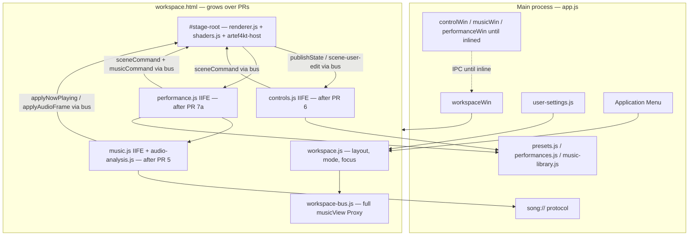
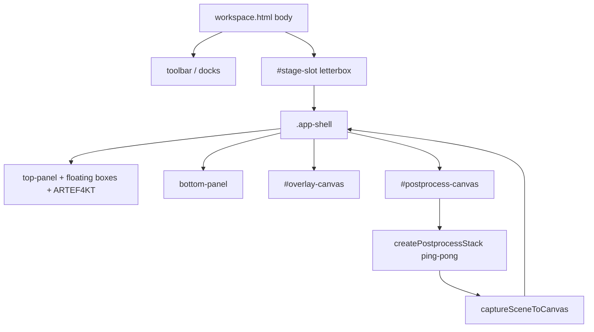
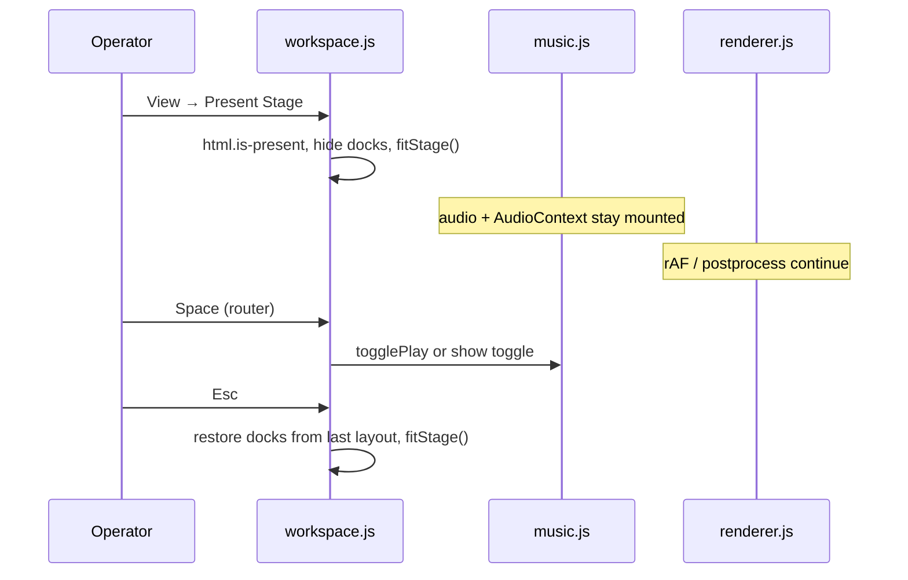

# Single-Window Workspace Overhaul

| Field | Value |
|-------|--------|
| **Title** | music_view Single-Window Workspace |
| **Author** | music_view |
| **Date** | 2026-08-13 |
| **Status** | Implemented. Living behavior: [system.md](../architecture/system.md). This file is the original design record. |
| **Location** | [docs/roadmap/fullscreen-single-window-plan.md](./fullscreen-single-window-plan.md) |
| **Target app** | `/Volumes/ARCHIVE/Dev/Projects/music_view` |
| **Depends on** | Display scene (`renderer.js`, `shaders.js`), Music transport (`music.js`, `audio-analysis.js`), Controls (`controls.js`), Performance conductor (`performance.js`), IPC hub (`app.js`, `preload.js`) |
| **Related** | [system.md](../architecture/system.md) · [how-it-works.md](../overview/how-it-works.md) · [audio-pipeline.md](../architecture/audio-pipeline.md) · [scene-model.md](../architecture/scene-model.md) · [commands.md](../reference/commands.md) · [keyboard-shortcuts.md](../reference/keyboard-shortcuts.md) · [ui-overhaul-plan.md](./history/ui-overhaul-plan.md) · [artef4kt-integration-plan.md](./artef4kt-integration-plan.md) · [performance-timeline-plan.md](./performance-timeline-plan.md) · [container-management-plan.md](./container-management-plan.md) |

---

## Overview

music_view is a local-file visual stage: pick a track, lyrics, and a visual *look*, then draw a portrait (9:16) scene and run a WebGL postprocess stack over it. Today that product is four Electron `BrowserWindow`s created in `createWindows()` (`app.js`): a non-resizable 1080×1920 **Display**, plus three floating editor windows (Controls **380**×720, Music ~400×700, Performance ~400×720). Closing Display tears down the rest. Live look edits, analysis frames, and the showcase conductor all hop through main-process IPC that *assumes* those four pages exist.

This plan replaces that OS-window cluster with **one dedicated application window**: a landscape (or native) workspace that *contains* the portrait stage as a pane, docks the four editor surfaces as panels, and adds a first-class **Present** mode that hides chrome and shows only the letterboxed stage. The scene model, shader packages, visual-only presets, analysis channel contract, ARTEF4KT same-document embed, and Performance documents stay. Playback remains local files. No new preset schema.

**Recommended architecture:** a **same-document workspace shell** with a strictly isolated `#stage-root > .app-shell` (so capture never includes editor chrome), an in-process **workspace bus** that is a **full Proxy** of today’s `window.musicView` keys, a **focus / mode** router for keyboards and menus, and a **dual mode** (Editor vs Present).

**Migration is not iframes.** Regular `<iframe src="*.html">` does not get `preload.js`, does not have its own `WebContents`, and `file://` + `webSecurity: true` blocks `parent.musicView`. `<webview>` guests still fail today’s `BrowserWindow.fromWebContents(event.sender)` checks. The honest path: **PR 3 replaces only the Display window** with a landscape workspace that hosts the stage; Controls / Music / Performance stay real `BrowserWindow`s until each is wrapped (IIFE + scoped queries + exported hooks) and then inlined. Optional second-output / projector is **deferred**, with a canvas-stream hook (`#postprocess-canvas` already uses `preserveDrawingBuffer: true` in `shaders.js`).

---

## Background & Motivation

### Current state (verified in tree)

| Concern | Today |
|---------|--------|
| Windows | `app.js` `createDisplayWindow` / `createControlWindow` / `createMusicWindow` / `createPerformanceWindow`. All `contextIsolation: true`, `nodeIntegration: false`, shared `preload.js` → `window.musicView`. Display is **non-resizable**, sized `1080×1920` scaled to the primary work area. Controls is **380**×`min(720, workArea)`. |
| Lifecycle | Display `closed` closes Controls, Music, Performance. Music `closed` sets `musicReady = false`, fails `pendingMusicCommands`, sends `music-closed` to Performance (conductor fail-closes per performance plan). `displayReady` / `musicReady` gate retries in `sendDisplayCommand` / `sendMusicCommand` (8s timeout, 12×250ms retries; 25s for `prepareShow` / `loadDeck` / `preloadDeck`). Darwin: `window-all-closed` does **not** quit; `activate` calls `createWindows()` if `BrowserWindow.getAllWindows().length === 0` (`app.js` ~744–754). |
| Role | `get-window-role` returns `'display' \| 'controls' \| 'music' \| 'performance'`. **No renderer currently calls `getRole()`** — identity is implicit via which HTML loaded. |
| Commands | Controls/Performance → `control-command` → `display-command` → `sceneCommand` → `replyCommand` → `display-command-result`. Performance/Music → `music-command` (sender must be `performanceWin` or `musicWin`). |
| Music → Display (F&F) | `now-playing`, `lyric-focus`, `playback-progress`, `audio-frame` (structured clone, **not JSON**), `empty-lyrics-fx`. Main only accepts these from `musicWin`. `audio-frame` is also the ARTEF4KT feed. |
| Fan-out | `now-playing` / `playback-progress` also go to Performance. `publish-state` only to Controls. `show-state` to Display + Controls + Music. `scene-user-edit` / `scene-transition` to Performance. `music-event` to Performance. |
| Capture | `captureSceneToCanvas` (`renderer.js` ~3550) paints **only** `.app-shell`: bottom strip, white stage, floating canvases (incl. ARTEF4KT / container PP), overlay. `createPostprocessStack` (`shaders.js`) uploads that 2D canvas as `u_scene`. `#postprocess-canvas` is `position:absolute; inset:0` **inside** `.app-shell`. WebGL contexts already set `preserveDrawingBuffer: true` (`shaders.js` ~126, ~518, ~789). |
| Stage sizing | `getShellSize()` uses `.app-shell` client box, **not** `window.innerWidth`, except as fallback. `window.__musicViewResizeCanvases` runs on `window.resize`. |
| Audio | Dual-deck `<audio id="audio-a">` / `<audio id="audio-b">` in `music.html`. One `AudioContext` via `createDeckMixer` / `createAudioAnalyser`. Display **must not** open a track AudioContext. `sendRateHz` default **50**, clamped 15–60. Waveform is 256-bin `Uint8Array`. |
| ARTEF4KT | Same-document mount (`artef4kt-host.js`). Embed constructor **returns before** `setupEventListeners()` (`script.js` ~386–392: `init()` → `initEmbedCameraControls()` → `animate()` → `return`). The Space listener at ~1407 is therefore **not** registered in embed. The other two `keydown` sites no-op when `#debug-info-panel` / `#ui` are absent (~7263, ~7642). Overlay IDs (`status-message`, `track-info-display`, …) are **global**; `ensureEmbedOverlays` already kills orphans. |
| Scripts | `renderer.js`, `controls.js`, `music.js`, `performance.js` are **classic top-level scripts**, not IIFEs. Each of the three tool files declares `const $ = (id) => document.getElementById(id)` and `document.addEventListener('DOMContentLoaded', init)`. `music.js` and `controls.js` both declare `let activeTab` and `function setActiveTab`. Concatenating them into one document is a `SyntaxError`. |
| Document-wide queries | `music.js` `setActiveTab` (~1378–1388) runs `document.querySelectorAll('.tab')` and `document.querySelectorAll('.tab-panel')` and `hidden`s every panel whose id is not `panel-${id}`. `controls.js` `setActiveTab` (~4144–4154) does the same for `.tab-btn` / `.tab-panel` / `tab-${look\|object}`. In one document, either click hides the other dock. |
| Menus / settings | No application `Menu`. No userData settings store. Window geometry is computed every launch. Per-origin `localStorage` / `sessionStorage` keys listed in Data Model. |
| File sizes | `renderer.js` 7656, `controls.js` 4924, `music.js` 2196, `shaders.js` 1197, `performance.js` 1098, `audio-analysis.js` 851, `app.js` 754. No bundler (`npm start` → `electron .`). |
| Colliding IDs | `#btn-play` and `#btn-stop` (music + performance), `#btn-refresh` (music + controls), `#preset-list` (controls live browser + performance `#preset-dialog` import `<select>`). Class names `.panel`, `.btn`, `.tab`, `.tab-panel`, `.status` are shared. |

### Pain points

1. Four OS windows do not feel like software. Users tile a portrait Display and three landscape inspectors around it; the stage is a *sibling window*, not the product surface.
2. Display is locked to a portrait *window*. A laptop is landscape. There is no Present / audience mode and no kiosk path.
3. `audio-frame` at ~50 Hz crosses two process hops (Music renderer → main → Display renderer) with a structured-clone `Uint8Array`. That cost is paid only because analysis and WebGL live in different documents.
4. Keyboard scopes are accidental (per-window). In one window, Space, `[`/`]`, `1`/`2`, `E`, Delete would collide immediately. Tool scripts also share top-level bindings and document-wide selectors.
5. Geometry is not persisted. Every launch re-tiles four windows from `screen.getPrimaryDisplay().workArea`.
6. Closing Music mid-show is a first-class failure mode only because Music is a disposable window.

### Why a single window is hard (design constraints)

1. **Capture must stay scoped to the portrait stage.** Putting chrome inside `.app-shell` would grade the editor UI. Cross-document canvases (iframe/webview WebGL) do not `drawImage` reliably — this is why ARTEF4KT is same-document.
2. **9:16 stage vs landscape chrome** is a layout problem, not a CSS afterthought. Letterboxing, stage resolution, and Present vs Edit are product modes.
3. **One AudioContext, one transport.** `createMediaElementSource` can attach once per `<audio>`. Analysis stays with the Music module. There is **one** track transport (Music) and **one** show transport (Performance) — do not invent a third.
4. **Keyboard / menu** need an explicit focus model. Today isolation is free because each HTML has its own `document`. Music Space today is `e.target === document.body` only (`music.js` ~1361–1368).
5. **ARTEF4KT** capture + overlay IDs must survive being in the same document. Do **not** add vendor `#ui` / `#debug-info-panel` to the workspace (those nodes would arm leftover listeners). Embed already skips `setupEventListeners`.
6. **Tool scripts are not isolated.** They cannot share a document until each is wrapped in an IIFE (or `window.MusicView*` export), queries are scoped to a dock root, and colliding IDs are renamed. Wrapping is a prerequisite for inline; it is not a full rewrite of `renderer.js`.

These constraints are unchanged from shipped contracts: presets remain visual-only (`exportPreset` / `applyPreset` / `loadPreset`); Performance snapshots stay unbound from named presets; unique roles stay unique; analysis is role-wired (`audio-scope` / `audio-history` / `audio-beat` / `artef4kt`).

---

## Goals & Non-Goals

### Goals

| Goal | Success look |
|------|----------------|
| **A. One BrowserWindow (destination)** | After cutover, `createWorkspaceWindow()` is the only factory. Typically maximized. Optional OS-fullscreen / kiosk via an explicit command, not the default launch. Transitional PRs may still open the three tool windows. |
| **B. Stage is a pane** | Portrait 9:16 is preserved inside a letterboxed `#stage-slot`. `.app-shell` fills only that slot. Capture / postprocess / container coords are unchanged in *stage space*. |
| **C. Docked editor surfaces** | Look, Object, Music (library / **its own** transport / analysis / empty-lyrics FX), Performance (cue list + **its existing** transport) live in the workspace — not four OS windows. |
| **D. Present mode** | One command hides chrome and shows only the stage (letterboxed in the window, or OS-fullscreen). Same command / Esc returns to the editor workspace. Live FX edits remain possible after return; music does not restart. |
| **E. Unified focus, keyboard, menu** | A workspace focus owner + Electron application menu. Space cannot both toggle the track *and* the show. Controls shortcuts do not fire while typing or while Performance is focused. |
| **F. Persisted layout** | Workspace window bounds / maximized / dock sizes / collapsed docks written to userData. **Reset Layout** restores defaults. Launch always opens **Editor** (never restore Present). |
| **G. Live editing preserved** | Tweaking FX / objects while music plays still works. `sceneCommand` names and `{ ok, state? }` remain. |
| **H. Contracts preserved** | Visual presets, shader packages, analysis channels, Performance JSON, ARTEF4KT embed, dual-deck + `setShowDriving` semantics. |
| **I. Incremental PRs** | Each PR independently reviewable and mergeable, in the style of `docs/roadmap/history/ui-overhaul-plan.md`. |

### Non-goals (v1)

- Streaming, accounts, playlists-as-product, undo/redo, new shader packs, preset schema v2.
- Splitting `renderer.js` / `controls.js` into a full module graph (optional extracts only where the shell forces them).
- Visual restyle of Music/Performance beyond what docking requires (density may match Controls later).
- A second projector / output window **as a v1 feature** (hook only — see Key Decisions).
- Keeping four always-on editor OS windows as the **default after cutover**, even behind a flag.
- Shadow DOM for panels (would break existing `getElementById` / query selectors).
- A bundler / TypeScript migration.
- Moving analysis onto Display or giving Display a track `AudioContext`.
- Blackout / panic as a new transport (still v1.1 of Performance).
- Composing tools with `<iframe>`, `<webview>`, or `BrowserView` (see Alternatives).

---

## Proposed Design

### Mental model

```
Workspace window (destination: one BrowserWindow, landscape)
  ├── App chrome (menu + toolbar + mode)
  ├── #dock-music     ← music.html body; owns <audio-a/b> + Music transport
  ├── #dock-controls  ← controls.html body; Look | Object
  ├── #dock-show      ← performance.html body; Show transport + cues
  └── #stage-slot
        └── .app-shell   ← THE ONLY thing capture sees
              ├── top-panel / bottom-panel / floating containers
              ├── ARTEF4KT canvas (role artef4kt)
              └── #postprocess-canvas
```

There is **no third transport**. The bottom dock *is* Performance’s existing `.transport-panel` (`#perf-btn-play`, `#perf-btn-stop`, `#btn-go`, …). Music’s play/stop/seek/volume stay in the left dock.

- **Display** remains the scene engine (`scene`, `sceneCommand`, capture, WebGL). It no longer *is* the OS window.
- **Controls / Music / Performance** remain domain modules with the same command surfaces. They no longer *are* OS windows after their inline PRs.
- **Workspace** is new: layout, mode, focus, menu, settings. It does not own scene JSON, audio graphs, or cue documents, and it does not own play/pause buttons.



### Recommendation and why

**Choose: same-document shell + dual-mode (Editor / Present). Transitional sibling tool windows, not guest panes.**

| Concern | Why same-document wins |
|---------|------------------------|
| Capture | `.app-shell` already defines the capture world (`getShellSize`, `captureSceneToCanvas`, overlay/PP canvases `inset:0` on the shell). Chrome lives *outside* that node. |
| `audio-frame` | 50 Hz × (256-byte wave + channels object + routing) becomes a function call into `applyAudioFrame` **once Music is inlined**. Until then, existing `musicWin` → main → `workspaceWin` IPC stays. |
| ARTEF4KT | Stays a child of a floating box inside `.app-shell`. `preserveDrawingBuffer` + host `drawImage` keep working. Overlay IDs stay in the stage subtree; workspace must not introduce `#ui` / `#debug-info-panel`. |
| Incremental PRs | Workspace + stage pane can ship while tools remain real `BrowserWindow`s (preload + sender checks unchanged except `displayWin` → `workspaceWin`). Each wrap+inline PR is independently reviewable. |
| Live edit | Controls already merge `state-update` without resetting focus. Same document only removes latency. |

**Rejected as adapters:** regular iframe (no preload, no guest `WebContents`, opaque `file://` origins), `<webview>` / `BrowserView` (guest `WebContents` still fail `BrowserWindow.fromWebContents`; layout is not CSS). See Alternatives.

### Boot sequence (destination)

1. `app.whenReady` → `registerSongProtocol()` (unchanged) → `createWorkspaceWindow()` (+ remaining tool windows until they are inlined).
2. Workspace loads `workspace.html`. `workspace.js` restores **editor** layout from user-settings, mounts chrome, sizes `#stage-slot` to max 9:16 **capped at 1080×1920 CSS px**.
3. Stage script runs (today’s `DOMContentLoaded` in `renderer.js`): `setupPostprocess` → `createSongInfoPanels` + `createAudioVizPanels` → `installSceneBridge` → `loadAndApplyPreset('default')` → `notifyDisplayReady` (bus flag + existing IPC for leftover tool windows).
4. Music module inits (own window, then later `#dock-music`): `ensureDeckMixer`, `wireMusicCommands`, assigns `window.__musicViewHandleMusicCommand` **before** `notifyMusicReady`.
5. Controls requests state (`getState` / `onState`).
6. Performance inits idle; no implicit show.

`displayReady` / `musicReady` remain. After inline they are **module** flags; command retries stay — first paint of a 7.6k-line renderer can still lose the race.

### 1. Window + security

**Destination** `createWorkspaceWindow()`:

```js
// Target shape (app.js) — after cutover this is the only factory
function createWorkspaceWindow() {
  const settings = userSettings.load();
  const work = screen.getPrimaryDisplay().workArea;
  const siblingTools = !!(musicWin || controlWin || performanceWin); // PR 3–6
  const TOOLBAR_H = 48;
  const reserveL = musicWin ? 400 : 0;
  const reserveR = controlWin ? 392 : 0;
  const reserveB = performanceWin ? 240 : 0;
  // PR 3–6: never fall back to 1600×1000 (that fills a 1440-wide laptop).
  const stageW = Math.min(1080, work.width - reserveL - reserveR);
  const stageH = Math.min(1920, Math.round(stageW * 16 / 9), work.height - TOOLBAR_H - reserveB);
  const bounds = siblingTools
    ? {
        width: Math.max(320, stageW),
        height: Math.max(480, stageH + TOOLBAR_H),
        x: work.x + reserveL,
        y: work.y,
      }
    : {
        width: settings.window?.width || Math.min(1600, work.width),
        height: settings.window?.height || Math.min(1000, work.height),
        x: settings.window?.x,
        y: settings.window?.y,
      };
  workspaceWin = new BrowserWindow({
    ...bounds,
    // PR 3–6: 1024 would clamp a ~648px reserved-strip frame on a 1440 laptop
    // and overlap Controls. Destination mins only after sibling tools are gone.
    minWidth: siblingTools ? 320 : 1024,
    minHeight: siblingTools ? 480 : 640,
    title: 'music_view',
    fullscreenable: true,
    webPreferences: {
      preload: preloadPath(),
      contextIsolation: true,
      nodeIntegration: false,
      webSecurity: true,
    },
  });
  workspaceWin.loadFile('workspace.html');
  // Destination (PR 7a+): maximize unless the user un-maximized.
  // PR 3–6: do not call maximize(); reserved strips + tool tiling (D15).
  if (!siblingTools && settings.window?.maximized !== false) workspaceWin.maximize();
  // never apply settings.window.fullScreen / settings.mode === 'present' on launch
}
```

**Transitional (PR 3–6) window placement (locked):** do **not** maximize the workspace while any tool is still a sibling `BrowserWindow`. Today’s factories tile relative to a portrait Display (`app.js` ~113–121, ~154–165, ~208–238). A maximized landscape workspace **is** the work area, so `dx + dw + 12` / `dx - musicWidth` land off-screen.

1. `createWorkspaceWindow()` stays **unmaximized**. Ignore `settings.window.maximized` until PR 7a.
2. Size = toolbar + largest 9:16 stage (≤ 1080×1920) that fits in the work area **after reserving strips** for still-open tools: **400px** left while `musicWin` exists, **392px** (380+12) right while `controlWin` exists, and **~240px** below Music while `performanceWin` exists. Center the remainder. **`minWidth` / `minHeight` must match that frame** (`320×480` while `siblingTools`; `1024×640` only at 7a+). Do not leave a destination `minWidth: 1024` on the transitional constructor — Chromium will expand a ~648px workspace over the Controls strip.
3. Retarget tiling to **`workspaceWin`**, not the old Display portrait math. Music: left of workspace. Controls: right of workspace. Performance: below Music (same column); if that overflows the work area, below Controls.
4. If the primary work area cannot fit workspace + reserved strips, put leftover tools on `screen.getDisplayNearestPoint(workspaceWin.getBounds())`’s sibling display when one exists; last resort is a cascade at `work.x+12, work.y+12` (documented, not silent overlap under a maximized frame).
5. **PR 7a** (no sibling tools left) starts honoring D1 maximize.

Closing the workspace still closes remaining tool windows (same as Display `closed` today). `sendDisplayCommand` targets `workspaceWin`. Music F&F `sender === musicWin` stays through PR 4; **PR 5** retargets the still-IPC channels to `workspaceWin` (see §4).

**Darwin lifecycle (locked):** keep platform hide-on-close. `window-all-closed` does not quit on Darwin. `activate` calls `createWorkspaceWindow()` (plus any not-yet-inlined tool factories) when `getAllWindows().length === 0`. After the last factory-delete PR, `activate` must **not** still call `createWindows()`. Closing the workspace on Windows/Linux quits (`window-all-closed`). If the user re-clicks the Dock icon after closing the last window, `activate` recreates the workspace (and remaining tool windows).

- **Default launch (destination, PR 7a+):** maximized workspace, **not** `setFullScreen(true)`, **not** Present. **PR 3–6:** unmaximized, reserved strips, tools tiled beside `workspaceWin`.
- `get-window-role`: `'workspace'` for the workspace page; tool windows keep `'controls' | 'music' | 'performance'` until deleted.
- No `BrowserView`. No second hidden Display window. No iframe guests.

GPU switches already in `app.js` stay.

### 2. Workspace chrome and layout

New files (v1):

| File | Role |
|------|------|
| `workspace.html` | Toolbar, docks, `#stage-slot`. Grows as modules are inlined. |
| `workspace.css` | Shell layout only. Does not restyle `.app-shell` internals. |
| `workspace.js` | Mode, docking, focus, Present, settings IPC. |
| `workspace-bus.js` | Full `musicView` Proxy + in-process overrides + cloning. |
| `workspace-hotkeys.js` | Single Space / Esc / app-map router (PR 7b). |
| `user-settings.js` | Main-process JSON in `app.getPath('userData')`. |

**Default Editor layout** (DAW/VJ — stage centered, inspectors on the sides, conductor secondary):

```
┌─ toolbar: music_view │ Look │ Object │ Music │ Show │  Present  Fullscreen ─┐
├────────────┬──────────────────────────────┬─────────────────────────────────┤
│ #dock-music│                              │ #dock-controls                  │
│ 360px      │     #stage-slot              │ 380px (shipped Controls width)  │
│ library +  │     max 9:16 .app-shell      │ Look / Object tabs              │
│ Music      │     ≤ 1080×1920 CSS          │                                 │
│ transport  │     letterbox around it      │                                 │
│ #music-btn-│                              │                                 │
│  play/stop │                              │                                 │
├────────────┴──────────────────────────────┴─────────────────────────────────┤
│ #dock-show  collapsed: .transport-panel only (~ existing Performance header)│
│   #perf-btn-play #perf-btn-stop #btn-go #btn-skip #btn-prev                 │
│   #show-clock #clip-meta #show-status                                       │
│ expanded (~240px): + #cue-list + #inspector                                 │
└─────────────────────────────────────────────────────────────────────────────┘
```

**Transport ownership (locked — option A):**

| Surface | What it is | What it is not |
|---------|------------|----------------|
| Music dock | Existing Music transport: `#music-btn-play`, `#music-btn-stop`, `#seek`, `#volume`, `#time-cur`, `#time-dur`, `#now-title` | Not cloned into a workspace chrome bar |
| Performance dock | Existing Performance `.transport-panel` (renamed play/stop ids) | Not a new Show strip beside a new workspace strip |
| Workspace toolbar | Mode + dock focus + Present | No play/stop/Go buttons |
| Present | No visible transport; Space via hotkey router | Must not unmount `#audio-a` / `#audio-b` |

Collapsed `#dock-show` uses CSS to hide `.doc-panel`, `.split`, `#status-line`, dialogs — **not** a second markup tree. Expanded reveals cues + inspector.

Rules:

- `#stage-slot` is a flex/grid cell. `fitStage()` sets `.app-shell` to the largest integer **9:16** that fits the slot, **capped at 1080×1920 CSS pixels**. Extra slot pixels are letterbox `#000`. Opt-in `settings.present.nativeStage === true` lifts the cap (not default).
- `.app-shell` is **not** `width/height: 100%` of the window. Workspace override: `.workspace #stage-root .app-shell { width: var(--stage-w); height: var(--stage-h); }`.
- `ResizeObserver` on `#stage-slot` calls `fitStage()` then `window.__musicViewResizeCanvases()`.
- Docks are resizable splitters. Collapse chevrons. Double-click splitter resets that dock to default width/height.
- Toolbar Look/Object call `window.__musicViewControls.setActiveTab('look'|'object')` (exported in the Controls wrap) and focus `#dock-controls`.
- Music tabs stay inside the Music dock (`window.MusicViewMusic.setActiveTab`).
- Visual restyle of Music/Performance: remove per-window page titles (`music-header` / `perf-header` h1); keep transports; constrain width.
- **PR 3 markup is stage + toolbar only.** `#dock-music` / `#dock-controls` / `#dock-show` are omitted from the grid (or `display: none` / zero track size). Empty dock columns must not reserve 360/380/48px while the real tools are still OS windows. Each inline PR enables that dock’s track and then `fitStage()`.

**Present mode** (`workspace.mode = 'present'`):

- `html.is-present`. Docks + toolbar `visibility: hidden` (or `display: none` **without removing nodes**). `#audio-a` / `#audio-b` stay in the document.
- `#stage-slot` is the only visible flex child. `fitStage()` letterboxes 9:16, still capped at 1080×1920 unless `nativeStage`.
- **Present Stage** and **Fullscreen Stage** are **separate commands**. Present hides chrome only. Fullscreen also `workspaceWin.setFullScreen(true)`.
- Stage pointer: container **drag and resize stay on** in Present (locked). No v1 `lockStage` toggle; `present.lockStage` in settings stays unused (`false`).
- Exit: Esc state machine below. Restore previous dock layout; do not reload modules.

**Kiosk:** View → Kiosk = Present + OS-fullscreen + `autoHideMenuBar`.

**Esc state machine** (single implementation in `workspace-hotkeys.js`):

| Priority | Condition | Action |
|----------|-----------|--------|
| 1 | `isTyping(target)` | `blur()` |
| 2 | Open menu / `<dialog>` / Controls overflow | Close it |
| 3 | `mode === 'present'` and not kiosk | Exit Present (no confirm) |
| 4 | kiosk | `window.confirm('Exit kiosk?')`; on OK leave fullscreen + Present |
| 5 | Performance `status === 'preview'` | Existing preview exit |
| 6 | else | no-op |

`Cmd+Shift+P` toggles Present from any non-typing focus. It is not gated on the confirm in kiosk (explicit menu/accel = intent).

### 3. Stage isolation (capture invariant)

> **Nothing that is not the audience picture may be a descendant of `.app-shell`.**



`captureSceneToCanvas` already sizes dest from `shell.clientWidth/Height` × DPR and positions floats via `getBoundingClientRect()` minus the shell.

Inlining the existing `index.html` body under `#stage-root` is sufficient if:

1. Workspace CSS does not make `.app-shell { width/height: 100% }` expand to the window.
2. `#postprocess-canvas { inset: 0 }` remains relative to `.app-shell`.
3. `getShellSize` fallback to `window.innerWidth` is replaced with the slot size.
4. Present may hide `.floating-box.is-selected` via a class on `#stage-root` (CSS, no new scene command).
5. Workspace markup never includes ARTEF4KT `#ui` or `#debug-info-panel`. Overlay IDs stay inside the floating box (`ensureEmbedOverlays`).

**Do not** wrap the stage in an iframe.

### 4. Workspace bus (full facade, not a subset)

Today every cross-role call is `preload.js` → `ipcMain` → `webContents.send` to a specific `BrowserWindow`.

**Do not rewrite Controls/Music/Performance against a new API in v1.** Keep `window.musicView.*` names.

**PR 2 lands a complete wrap.** Do not hand-write a subset of the ~40 `musicView` keys.

```js
// workspace-bus.js
const JSON_CLONE_PUBLISHERS = new Set([
  'publishState', 'publishNowPlaying', 'publishLyricFocus',
  'publishPlaybackProgress', 'publishEmptyLyricsFx',
  'publishMusicEvent', 'publishShowState',
  'publishSceneUserEdit', 'publishSceneTransition',
]);

function jsonClone(value) {
  return JSON.parse(JSON.stringify(value));
}

function cloneResult(result) {
  let safe;
  try {
    safe = jsonClone(result ?? { ok: false, error: 'null result' });
  } catch (e) {
    safe = { ok: false, error: 'Failed to serialize result: ' + (e && e.message ? e.message : e) };
  }
  if (typeof safe.ok !== 'boolean') {
    safe = { ok: false, error: 'Invalid result shape', raw: safe };
  }
  return safe;
}

function createWorkspaceBus(ipc, flags) {
  const listeners = new Map();
  function on(channel, cb) { /* Set; return unsub */ }
  function emit(channel, data) { /* … */ }

  const overrides = {
    getRole: () => Promise.resolve(flags.role || 'workspace'),

    async sendCommand(command, payload) {
      if (window.containerAPI && typeof window.containerAPI.sceneCommand === 'function'
          && flags.inProcessDisplay) {
        return cloneResult(await window.containerAPI.sceneCommand(command, payload));
      }
      return ipc.sendCommand(command, payload);
    },

    async sendMusicCommand(command, payload) {
      const fn = window.__musicViewHandleMusicCommand;
      if (typeof fn === 'function' && flags.inProcessMusic) {
        return cloneResult(await fn(command, payload));
      }
      return ipc.sendMusicCommand(command, payload);
    },

    publishAudioFrame(payload) {
      if (flags.inProcessAudio) {
        emit('audio-frame', payload); // no JSON clone — Uint8Array
        return;
      }
      return ipc.publishAudioFrame(payload);
    },
    onAudioFrame(cb) {
      if (flags.inProcessAudio) return on('audio-frame', cb);
      return ipc.onAudioFrame(cb);
    },

    // Rule: a channel flag flips **both** publishX and onX onto the same emit/on map.
    // installSceneBridge / Controls / Performance subscribe via on*, not a side channel.
    publishNowPlaying(p) { return flags.inProcessAudio ? emit('now-playing', jsonClone(p)) : ipc.publishNowPlaying(p); },
    onNowPlaying(cb) { return flags.inProcessAudio ? on('now-playing', cb) : ipc.onNowPlaying(cb); },
    publishLyricFocus(p) { return flags.inProcessAudio ? emit('lyric-focus', jsonClone(p)) : ipc.publishLyricFocus(p); },
    onLyricFocus(cb) { return flags.inProcessAudio ? on('lyric-focus', cb) : ipc.onLyricFocus(cb); },
    publishEmptyLyricsFx(p) { return flags.inProcessAudio ? emit('empty-lyrics-fx', jsonClone(p)) : ipc.publishEmptyLyricsFx(p); },
    onEmptyLyricsFx(cb) { return flags.inProcessAudio ? on('empty-lyrics-fx', cb) : ipc.onEmptyLyricsFx(cb); },

    // Until 7a: IPC-only (Performance window). After 7a: emit/on pair, no IPC.
    publishPlaybackProgress(p) {
      return flags.inProcessPerfFanout ? emit('playback-progress', jsonClone(p)) : ipc.publishPlaybackProgress(p);
    },
    onPlaybackProgress(cb) {
      return flags.inProcessPerfFanout ? on('playback-progress', cb) : ipc.onPlaybackProgress(cb);
    },
    publishMusicEvent(p) {
      return flags.inProcessPerfFanout ? emit('music-event', jsonClone(p)) : ipc.publishMusicEvent(p);
    },
    onMusicEvent(cb) {
      return flags.inProcessPerfFanout ? on('music-event', cb) : ipc.onMusicEvent(cb);
    },

    publishState(state) {
      const safe = jsonClone(state);
      return flags.inProcessState ? emit('state-update', safe) : ipc.publishState(safe);
    },
    onState(cb) {
      return flags.inProcessState ? on('state-update', cb) : ipc.onState(cb);
    },

    // Display → Performance; must flip with 7a (performanceWin is gone).
    publishSceneUserEdit(p) {
      return flags.inProcessPerfFanout ? emit('scene-user-edit', jsonClone(p)) : ipc.publishSceneUserEdit(p);
    },
    onSceneUserEdit(cb) {
      return flags.inProcessPerfFanout ? on('scene-user-edit', cb) : ipc.onSceneUserEdit(cb);
    },
    publishSceneTransition(p) {
      return flags.inProcessPerfFanout ? emit('scene-transition', jsonClone(p)) : ipc.publishSceneTransition(p);
    },
    onSceneTransition(cb) {
      return flags.inProcessPerfFanout ? on('scene-transition', cb) : ipc.onSceneTransition(cb);
    },
    // remaining keys: Proxy → ipc[name]
  };

  return new Proxy(ipc, {
    get(target, prop) {
      if (prop in overrides) return overrides[prop];
      const v = target[prop];
      return typeof v === 'function' ? v.bind(target) : v;
    },
  });
}
```

**Assignment** (workspace page only, after preload):

```js
window.musicView = createWorkspaceBus(window.musicView, flags);
```

Tool windows that are still separate **do not** load the bus; they keep the preload object.

`scripts/test-workspace-bus.js` (`node --test`) asserts `Object.keys(createWorkspaceBus(fakeIpc)).sort()` equals the documented preload key set (fixture copied from `preload.js` / a shared `music-view-api.json`). Missing keys fail CI/`npm test`.

#### Preload key set (must all exist on the bus)

`getRole`, `sendCommand`, `requestState`, `onState`, `publishState`, `notifyDisplayReady`, `onDisplayCommand`, `replyCommand`, `listSongs`, `loadLyrics`, `loadSong`, `getCover`, `getSongDisplayInfo`, `publishNowPlaying`, `onNowPlaying`, `publishLyricFocus`, `onLyricFocus`, `publishPlaybackProgress`, `onPlaybackProgress`, `publishAudioFrame`, `onAudioFrame`, `publishEmptyLyricsFx`, `onEmptyLyricsFx`, `listPresets`, `loadPresetFile`, `savePresetFile`, `deletePresetFile`, `getDefaultPresetName`, `listPerformances`, `loadPerformanceFile`, `savePerformanceFile`, `deletePerformanceFile`, `sendMusicCommand`, `notifyMusicReady`, `onMusicCommand`, `replyMusicCommand`, `publishMusicEvent`, `onMusicEvent`, `publishShowState`, `onShowState`, `publishSceneUserEdit`, `onSceneUserEdit`, `publishSceneTransition`, `onSceneTransition`, `onMusicClosed`.

New keys (workspace page only, added when first needed): `getSettings`, `setSettings`, `resetSettings`, `onWorkspaceCommand`.

#### In-process vs IPC by PR

| Channel | PR 3 (stage in workspace; 3 tool windows) | PR 5 (Music inlined) | PR 6 (Controls inlined) | PR 7a (Performance inlined) |
|---------|-------------------------------------------|----------------------|-------------------------|-----------------------------|
| `sendCommand` / display-command | IPC → `workspaceWin` | IPC (Controls still a window) | **in-process** `sceneCommand` + `cloneResult`. Performance window still IPC | **in-process** for all |
| `onDisplayCommand` / `replyCommand` | Still used by `installSceneBridge` for IPC | same | still used until 7a (Performance IPC) | unused; `sendCommand` does not also fire IPC |
| `sendMusicCommand` | IPC → `musicWin` | **in-process** `await __musicViewHandleMusicCommand`; Performance IPC `sendMusicCommand` must target **`workspaceWin`** | same | **in-process** |
| `audio-frame` + `onAudioFrame` | IPC `musicWin` → `workspaceWin` | **in-process publish+on** (no JSON, no IPC — Performance does not listen) | in-process | in-process |
| `now-playing` / `lyric-focus` / `empty-lyrics-fx` + matching `on*` | IPC | **in-process publish+on** (`flags.inProcessAudio`). `installSceneBridge` must use these `on*` (not leftover `ipc.on*`). Performance does **not** call `onNowPlaying` | in-process | in-process |
| `playback-progress` + `onPlaybackProgress` | IPC `musicWin` → Display + Performance | **IPC-only** (`inProcessPerfFanout` off). Both `publish*` and `on*` stay on `ipc.*`. Main accepts **`sender === workspaceWin`**, fans out to `performanceWin` **and** `workspaceWin` | same | **in-process publish+on**; stop IPC |
| `music-event` + `onMusicEvent` | IPC → `performanceWin` | **IPC-only** (publish+on via ipc). Main accepts `workspaceWin` → `performanceWin` | same | **in-process publish+on**; stop IPC |
| `publishState` + `onState` | IPC → `controlWin` | IPC (publish+on via ipc) | **in-process publish+on** (`inProcessState`) | in-process |
| `scene-user-edit` / `scene-transition` + matching `on*` | IPC → `performanceWin` | IPC | IPC | **in-process publish+on** (`inProcessPerfFanout`). `performanceWin` is gone — do not leave these on main fan-out |
| `show-state` + `onShowState` | IPC | IPC | IPC | unused by renderers today; may stay IPC or no-op |
| `listSongs`, presets, performances | always IPC invoke | always IPC | always IPC | always IPC |
| `onMusicClosed` | Music window `closed` | workspace emits if Music `init()` throws | same | same |

**Pairing rule (locked):** flipping a flag moves **both** `publishX` and `onX` onto the in-process map (same shape as `audio-frame`). A publish-only flip leaves `installSceneBridge` / Controls / Performance subscribed to IPC that is no longer sent.

**Flags** flip in the same PR that inlines the module. Never dual-path a channel (emit **and** `ipc.publish*`): Display would apply twice if it still has `ipc.on*`. `sendCommand` in-process **must not** also invoke IPC (would double-run and leave `pendingCommands` hanging).

**PR 5–7a F&F rule (locked):**

| Publisher | Path until 7a | Main `sender` check starting PR 5 |
|-----------|----------------|-------------------------------------|
| `audio-frame`, `now-playing`, `lyric-focus`, `empty-lyrics-fx` | In-process emit only | unused (do not require `musicWin`) |
| `playback-progress` | IPC only → `workspaceWin` + `performanceWin` | `sender === workspaceWin` |
| `music-event` | IPC only → `performanceWin` | `sender === workspaceWin` |
| `scene-user-edit`, `scene-transition` | IPC → `performanceWin` until 7a | unused after 7a (in-process) |

Performance today consumes `onPlaybackProgress`, `onMusicEvent`, `onSceneUserEdit`, and `onSceneTransition` (`performance.js` ~1052–1082). It does not call `onNowPlaying`.

**Required window hooks (do not exist today):**

| Hook | Set by | When |
|------|--------|------|
| `window.containerAPI.sceneCommand` | `renderer.js` ~7656 (already) | always after Display init |
| `window.__musicViewHandleMusicCommand` | Music wrap = `handleMusicCommand` | **before** `notifyMusicReady` (PR 5; also set in wrap-while-windowed PR 4 so the name exists) |
| `window.MusicViewMusic` | `{ handleMusicCommand, setActiveTab, togglePlay }` | wrap PR / inline |
| `window.__musicViewControls` | `{ setActiveTab }` | Controls wrap / PR 6 |
| `window.MusicViewShow` | `{ playShow, goNext, jumpTo }` | Performance wrap / PR 7a |

`handleMusicCommand` is file-scoped today and some cases return Promises (`loadDeck`, `prepareShow`, `seekDeck`, `playDeck`, …). The bus **always `await`s**. Callers already `await sendMusicCommand`.

**`publishState` clone lives in the bus**, not in `renderer.js` (`publishSceneState` ~6777 passes `getSceneState()` straight into `musicView.publishState`; today’s clone is **preload**). An in-process emit that skipped the clone would hand Controls the live scene object.

**`audio-frame` must not JSON-clone.** Music already reuses `waveCopyBuf`.

### 5. Audio ownership (no second graph)

Invariant from [audio-pipeline.md](../architecture/audio-pipeline.md): analysis runs only in the Music module; Display consumes frames.

- `<audio id="audio-a">` and `<audio id="audio-b">` live in `#dock-music`. Present hides the dock; **does not destroy** the nodes.
- `ensureDeckMixer()` / `createAudioAnalyser(..., { context, sourceNode, tapOnly })` unchanged.
- After PR 5: `publishAudioAnalysisFrame` → bus → `applyAudioFrame` + `feedArtef4ktAnalysis`.
- Display still must not create a MediaElementSource.
- `showDriving` + Take over banner remain in the Music dock (performance plan K17). Performance’s `#show-status` already reflects show state — no extra workspace pill required.

Throughput target: same 50 Hz default; **p95 applyAudioFrame < 2 ms** once in-process. `WAVE_BINS = 256`.

`onMusicClosed`: after Music is inlined, it cannot fire from a user closing a window. If Music `init()` throws, workspace `emit('music-closed')` so Performance fail-closes. While Music is still a window (PR 3–4), existing `closed` handler stays.

### 6. Focus, keyboard, and menu

#### Focus owner

```
workspace.focus ∈ { stage, look, object, music, performance, text }
```

| Owner | How it is set | Shortcuts that fire |
|-------|----------------|---------------------|
| `text` | `input, textarea, select, [contenteditable]` | Esc blurs (step 1 of Esc machine) |
| `look` | Controls Look tab or toolbar Look | Look map (`E`, Delete, Alt+↑/↓, `/`) |
| `object` | Controls Object tab, or click-select on stage | `[` `]` cycle containers |
| `music` | `#dock-music` focus | Space = track play/pause **unless** `showDriving` |
| `performance` | `#dock-show` focus (including collapsed transport) | Space = show; Enter/G = Go; `[` `]` = jump clip |
| `stage` | Click `#stage-slot` background or a float | Pointer only for `[`/`]`. `1`/`2` still switch Look/Object. **Space uses transport fallback** |

\* Click-to-select sets Object selection **and** `focus = object`.

#### Space (replaces Music’s `target === document.body`)

Today Music only toggles when `e.code === 'Space' && e.target === document.body` (`music.js` ~1361; shortcuts doc agrees). Gating that listener with `__musicViewFocus` would **not** implement the table: focusing any Music control makes Space a no-op.

**PR 7b deletes the Music body check** and implements one router:

```
if (isTyping(target)) return;
if (e.code !== 'Space') /* other maps */;
preventDefault;
if (showDriving || focus === 'performance' || (present && inShow && focus !== 'music'))
  → MusicViewShow.playShow / toggle
else
  → MusicViewMusic.togglePlay
```

Transport fallback when `focus === 'stage'` or Present: `showDriving` → show toggle; else track toggle.

Conflict table:

| Key | Today | Workspace |
|-----|-------|-----------|
| Space | Music: body-only track (or show if driving). Performance: **always** show. | Single router above. Never both. |
| `[` `]` | Controls Object: containers. Performance: clips. | Routed by focus. |
| `1` `2` | Controls tabs | Global unless typing: `__musicViewControls.setActiveTab` + focus Look/Object. |
| `E` / Delete | Controls Look layer | Only `focus === look`. |
| `/` | Controls preset search | Only `focus === look`. |
| Esc | Close menus / blur / exit preview | State machine in §2. |
| Enter / G | Performance Go | `focus === performance` **or** Present + `inShow`. |

PR 7b **replaces** (does not merely gate) the Music Space listener. Controls and Performance maps are gated by focus until their logic is copied into the router; then the `document` listeners are removed.

#### ARTEF4KT keys (not a blocker)

Embed **does not** register Space. Hygiene (optional, not on the critical path): wrap the three vendor listeners in `if (!this.embedMode)`. **Invariant:** workspace HTML must not contain `#ui` or `#debug-info-panel`. Overlay global IDs remain a same-document risk if a second embed mounts; `ensureEmbedOverlays` already removes orphans.

#### Application menu

`Menu.setApplicationMenu` in main. PR 1 lands the skeleton (stubs). PR 7c wires commands via `workspaceWin.webContents.send('workspace-command', name)`.

| Menu | Items |
|------|--------|
| **music_view** | About (later), Hide, Quit |
| **File** | Load Look…, Save Look, New/Open/Save Performance, Close (quit on non-mac) |
| **View** | Present Stage (`Cmd+Shift+P`), Fullscreen Stage (`Cmd+Ctrl+F` / F11), Toggle docks, **Reset Layout**, Kiosk |
| **Playback** | Play/Pause (router), Stop — enabled from music-event / show-state |
| **Show** | Go, Skip, Previous — disabled when no performance |
| **Window** | Minimize, Zoom |

No File → song picker in v1.

### 7. User settings store

New `user-settings.js` (main), same style as `presets.js`: `path.join(app.getPath('userData'), 'user-settings.json')`. **No new npm dependency.**

```json
{
  "version": 1,
  "window": {
    "x": 12, "y": 40, "width": 1600, "height": 1000,
    "maximized": true
  },
  "docks": {
    "left":  { "id": "music", "width": 360, "collapsed": false },
    "right": { "id": "controls", "width": 380, "collapsed": false, "tab": "look" },
    "bottom": { "id": "performance", "height": 240, "collapsed": true }
  },
  "present": { "nativeStage": false, "lockStage": false }
}
```

- **PR 1** only: load / validate / save / `settings-get` / `settings-set` / `settings-reset`. **Do not** persist four-window bounds (those keys die in PR 3 and would never prove the destination schema).
- **PR 3** starts writing `window` bounds on `resize` / `move`. Do **not** persist or restore `maximized: true` until PR 7a (transitional tiling needs an unmaximized workspace).
- Dock sizes are written when that dock exists in the workspace (PR 5/6/7a) or in one pass in PR 8.
- **Launch always forces Editor.** Do not persist `mode` as something launch restores. Do not persist `fullScreen`. If a previous crash left the OS window fullscreen, `createWorkspaceWindow` still starts windowed/maximized.
- **Reset Layout** writes defaults and applies without reload if possible.
- Not in presets. Not songs/lyrics/playback. Songs directory stays out of v1 (`music-library.js` candidates). `present.lockStage` is unused (drag stays on).

### 8. Module boundaries and script isolation

Keep classic scripts (no bundler). **Do not load two unwrapped tool scripts in one document.**

**Wrap contract** (each tool file, in its wrap step — PR 4 while still windowed, so `npm start` still has separate documents and regressions are obvious):

```js
// music.js (same idea for controls.js / performance.js)
(function (root) {
  const $ = (id) => {
    const scope = root.document.getElementById('dock-music') || root.document;
    return scope.querySelector('#' + id);
  };
  function qsAll(sel) {
    const scope = root.document.getElementById('dock-music') || root.document;
    return scope.querySelectorAll(sel);
  }
  // setActiveTab uses qsAll('.tab') / qsAll('.tab-panel') — not document.
  // …
  root.__musicViewHandleMusicCommand = handleMusicCommand;
  root.MusicViewMusic = { handleMusicCommand, setActiveTab, togglePlay };
})(window);
```

When the file still lives in `music.html`, `#dock-music` is absent → scope is `document` → behavior unchanged. After inline, queries cannot hide `#tab-look`.

**Wrap-time keydown gate** (same PR 4; required before 7a shares a document):

```js
// music.js Space handler
if (window.__musicViewFocus && window.__musicViewFocus !== 'music' && !showDriving) return;
// performance.js wireKeys
if (window.__musicViewFocus && window.__musicViewFocus !== 'performance') return;
// controls.js document keydown
if (window.__musicViewFocus
    && window.__musicViewFocus !== 'look'
    && window.__musicViewFocus !== 'object') return;
```

`__musicViewFocus` is unset in a solo tool window → today’s behavior. When the first dock is inlined, `workspace.js` **`init` sets a default** (`'music'` once Music is in-page, else `'stage'`), then updates on capture-phase `pointerdown` (PR 5: `#dock-music` / `#stage-slot`; PR 6 adds `#dock-controls`; PR 7a adds `#dock-show`). Do not wait for the first click: after 7a, Space on launch with unset focus would run Music `document.body` **and** Performance `wireKeys`. PR 7a must not ship Performance `wireKeys` without this gate. Smoke: Space **before any click** toggles only the default owner’s clock.

`audio-analysis.js` is already an IIFE (`window.AudioAnalysis`). `renderer.js` stays a top-level script (only one copy). `param-mod.js` / `scene-match.js` already tolerate dual load — **but do not rely on that.** Each inline PR copies **markup only** from `music.html` / `controls.html` / `performance.html`. Do **not** paste their `<script src>` tags into `workspace.html` (`param-mod.js` is already in the workspace order; `audio-analysis.js` is already listed before `music.js`).

**Destination script order in `workspace.html`:**

```text
preload → workspace-bus.js
param-mod.js → shaders.js → artef4kt-host.js → scene-match.js → renderer.js
audio-analysis.js → music.js          // IIFE
controls.js                          // IIFE
performance.js                       // IIFE
workspace-hotkeys.js → workspace.js
```

| Boundary | Mechanism |
|----------|-----------|
| Stage CSS | `main.css` unchanged; new rules prefixed `.workspace`. Override `.app-shell` size only under `#stage-root`. |
| Tool CSS | Load `controls.css`, `music.css`, `performance.css` under `#dock-*`. Fix conflicts only. |
| JS scope | IIFE wrap + `window.MusicView*` / hooks. **Not** Shadow DOM. |
| ID collisions | Rename table below, in the wrap/inline PR for that dock. |
| Selectors | `qsAll` scoped to dock. Acceptance: Music tab click must not `hidden` `#tab-look`. |

Splitting `renderer.js` is **not** required.

### 9. Present vs Edit vs (later) second output



**Second output (deferred).** Same-document makes a second live Display engine the wrong hook. v1 hook:

```js
window.containerAPI.getOutputCanvas = () => document.getElementById('postprocess-canvas');
// later: canvas.captureStream(60) → second BrowserWindow <video>
```

`#postprocess-canvas` already creates WebGL with `preserveDrawingBuffer: true` (`shaders.js` ~126, ~518, ~789). A future `captureStream` does **not** need a second Display engine or a PDB retrofit. Do not implement the projector window here.

### 10. CSS / HTML composition

```html
<body class="workspace">
  <header id="app-toolbar">…</header>
  <div id="workspace-grid">
    <!-- PR 3: only #stage-slot. Docks added when that module is inlined. -->
    <aside id="dock-music"><!-- PR 5: music.html body markup, no script tags --></aside>
    <div id="stage-slot">
      <div id="stage-root">
        <div class="app-shell">…index.html body (PR 3)…</div>
      </div>
    </div>
    <aside id="dock-controls"><!-- PR 6: controls.html body markup, no script tags --></aside>
    <footer id="dock-show"><!-- PR 7a: performance.html body markup, no script tags --></footer>
  </div>
</body>
```

`index.html` / `controls.html` / `music.html` / `performance.html` remain loadable through the transitional PRs. After 7d they become partials / reference. Do not keep them as top-level windows after cutover.

---

## API / Interface Changes

### `window.musicView` (preload + bus)

| Method | v1 change |
|--------|-----------|
| `getRole()` | `'workspace'` on the workspace page. Unused by renderers today. |
| `sendCommand` | In-process `sceneCommand` + `cloneResult` when `flags.inProcessDisplay`; else IPC. Never both. |
| `onDisplayCommand` / `replyCommand` | Remain for IPC senders until 7a. In-process `sendCommand` does not enqueue `pendingCommands`. |
| `sendMusicCommand` | `await __musicViewHandleMusicCommand` + `cloneResult` when `flags.inProcessMusic`. After PR 5, main `sendMusicCommand` targets `workspaceWin` for any remaining windowed sender. |
| `publishAudioFrame` / `onAudioFrame` | In-process after PR 5; **no JSON clone**. |
| `publishNowPlaying` / `onNowPlaying` (and lyric / empty-lyrics pairs) | In-process **publish+on** after PR 5; no IPC. |
| `publishState` / `onState` | In-process **publish+on** after PR 6. |
| `publishPlaybackProgress` / `onPlaybackProgress`, `publishMusicEvent` / `onMusicEvent` | **IPC-only until 7a** (main accepts `workspaceWin`). In-process **publish+on** starting 7a. |
| `publishSceneUserEdit` / `onSceneUserEdit`, `publishSceneTransition` / `onSceneTransition` | IPC until 7a → `performanceWin`. In-process **publish+on** at 7a (`inProcessPerfFanout`). |
| JSON publishers | Clone in the **bus** (preload today). |
| `notifyDisplayReady` / `notifyMusicReady` | Set bus flags; still send IPC while tool windows exist. |
| `onMusicClosed` | Window `closed` until Music inlined; then Music `init` failure only. |
| FS invokes | Unchanged IPC. |
| **New** settings + `onWorkspaceCommand` | Workspace page. |

### Main process

| Today | After PR 3 | After PR 5 | After 7d |
|-------|------------|------------|----------|
| 4× window refs | `workspaceWin` + 3 tools, **unmaximized**, tiled | `workspaceWin` + Controls + Performance | `workspaceWin` only, maximized |
| `sendDisplayCommand` → `displayWin` | → `workspaceWin` | same | unused if all in-process |
| Music F&F `sender === musicWin` | unchanged (`musicWin` exists) | **`playback-progress` / `music-event` accept `workspaceWin`**; Display-only channels no longer IPC | unused |
| `music-command` from `performanceWin` \| `musicWin` | same | `performanceWin` \| `workspaceWin` | unused |
| `activate` → `createWindows()` | → `createWorkspaceWindow` + remaining tool factories | same | → `createWorkspaceWindow` only |
| No menu / settings | menu skeleton + settings IO | same | menu wired |

### Display / Music commands

**No new scene commands.** Prefer CSS for Present selection outline.

Music commands unchanged. Performance keeps `sendMusicCommand`.

### HTML IDs (page-local, not IPC)

| Old | New | PR |
|-----|-----|----|
| music `#btn-play` | `#music-btn-play` | 5 (or wrap PR 4) |
| music `#btn-stop` | `#music-btn-stop` | 5 / 4 |
| performance `#btn-play` | `#perf-btn-play` | 7a / 4 |
| performance `#btn-stop` | `#perf-btn-stop` | 7a / 4 |
| music `#btn-refresh` | `#music-btn-refresh` | 5 / 4 |
| controls `#btn-refresh` | `#ctrl-btn-refresh` | 6 / 4 |
| controls `#preset-list` | `#ctrl-preset-list` | 6 / 4 |
| performance `#preset-list` | `#perf-preset-list` | 7a / 4 |

`$()` / `qsAll` call sites update in the same PR as the markup. Wrap PR 4 may rename while files are still separate (safe, independently testable).

---

## Data Model Changes

### Presets / performances / shaders

**None.**

### New: `user-settings.json` (userData)

Schema in §7. `version: 1`. Unknown keys ignored. Missing file → defaults (maximized, Music 360, Controls **380**, Performance collapsed). No four-window `windows.display` shape.

### `localStorage` / `sessionStorage`

One origin after inline — they just work. Complete inventory:

| Key | Where | Store |
|-----|--------|--------|
| `music_view_audio_viz` | music.js | localStorage |
| `music_view_music_tab` | music.js | localStorage |
| `music_view_empty_lyrics_fx` | music.js | localStorage |
| `music_view_preset_favorites` | controls.js | localStorage |
| `music_view_preset_recent_used` | controls.js | localStorage |
| `music_view_preset_cat` | controls.js | localStorage |
| `music_view_preset_sort` | controls.js | localStorage |
| `music_view_preset_type` | controls.js | localStorage |
| `music_view_preset_instant` | controls.js | localStorage |
| `music_view_controls_tab` | controls.js | **sessionStorage** |
| `music_view_controls_obj_seg` | controls.js | sessionStorage |
| `music_view_controls_adv_uniforms` | controls.js | localStorage |
| `music_view_ug` (+ per-group suffix) | controls.js | localStorage |
| `music_view_debug_stage` | workspace (new, optional) | localStorage |

No migration.

---

## Alternatives Considered

### 1. Same-document shell (chosen)

One HTML eventually; tools wrapped then inlined; Display/Controls/Music/Performance become docks.

| Pros | Cons |
|------|------|
| Best capture story | ID/CSS/selector collisions; top-level `const $` clash |
| `audio-frame` becomes a call (after Music inline) | Second *live* Display later needs a stream |
| Unified theme, drag, focus, menu | Must wrap scripts first |
| Incremental via sibling windows → wrap → inline | — |

### 2. `<webview>` / iframe / `BrowserView` panes — **rejected as the adapter**

| Mechanism | Why it is not implementable as “just compose the four HTMLs” |
|-----------|--------------------------------------------------------------|
| `<iframe src="music.html">` | Top-frame `preload` does not apply. No guest `WebContents`. `BrowserWindow.fromWebContents(event.sender)` is the **host**. `file://` + `webSecurity: true` treats each file as an opaque origin — `parent.musicView` is a `SecurityError`. |
| `<webview preload>` | Has a guest `WebContents`, but `BrowserWindow.fromWebContents(guest)` is still the host. Mapping must be `event.sender.id` / `event.senderFrame.url` and every sender check in `app.js` must change. Extra guest process + `song://`. |
| `BrowserView` | Same identity problem; `setBounds` is main-process pixels, not CSS splitters. |

Not used in any PR.

### 3. Dual-mode only, composition unspecified

Necessary but not sufficient. Combined with (1).

### 4. Optional second output as v1 / keep Display as a real window forever

Rejected as the **destination**. PR 3 **does** keep three editor windows temporarily; that is not the product.

**v1 projector:** `getOutputCanvas()` + existing PDB + later `captureStream`. Revisit a second engine only if measured stream latency is > ~2 frames.

---

## Security & Privacy Considerations

| Threat | Mitigation |
|--------|------------|
| Renderer gains Node | Unchanged: `contextIsolation: true`, `nodeIntegration: false`. Bus is renderer-only. |
| `song://` path escape | Unchanged `resolveSongPath`. |
| Lyrics/cover path escape | Unchanged handlers. |
| Any module sends `control-command` | Already true. In-process, any script can call `sceneCommand`. Local single-user app. |
| Settings file write | Validate shape (clamp widths, ignore unknown). No `eval`. |
| Present / kiosk | Esc machine; kiosk confirms. DevTools stay in dev. |
| ARTEF4KT | Same-origin file loads. No `#ui` in workspace. Overlay ID cleanup stays. |

No accounts, no telemetry, no cloud. UserData settings contain window/dock geometry only.

---

## Observability

| Signal | How |
|--------|------|
| Workspace boot | `console.info('[workspace] ready', { displayReady, musicReady, mode })` |
| Stage fit | `localStorage.music_view_debug_stage=1` logs `{ slot, stage, dpr }` |
| Bus fallback | Warn once if `sendCommand` hits IPC while `flags.inProcessDisplay` is true |
| Audio path | Existing viz status; debug `frame.via = 'bus' \| 'ipc'` |
| Capture failures | Existing `console.warn` in `shaders.js` |
| Ready timeouts | Existing errors in Controls/Performance status |

Manual smoke (adjust to which PRs have landed):

1. Launch → 9:16 stage ≤ 1080×1920 letterboxed, default preset. PR 3–6: workspace **unmaximized**, tool windows tiled beside it (not under a maximized frame). PR 7a+: one maximized workspace.
2. Play a track → cover, lyrics, progress, scope/history/beat, ARTEF4KT react. After PR 5, confirm `audio-frame` still arrives with `waveform instanceof Uint8Array`, and cover + lyrics update via in-process `onNowPlaying` / `onLyricFocus` (not a dead IPC wait).
3. `sendCommand` / `sendMusicCommand` resolve (`getState`, `getTransportState`).
4. Load a layout preset + an FX-only `look-*` → layout kept on FX-only (K4).
5. Edit an FX slider while playing → no audio glitch.
6. After 7b: Space in Music dock vs Performance dock vs Present vs a text field; Music Space works when a Music control (not `body`) is focused.
7. After 7c: Present → chrome gone, audio continues, Esc restores docks; kiosk Esc confirms.
8. After 8: Reset Layout; relaunch → dock sizes persist; **not** Present; song does not persist.
9. After each inline: Music tab click does not `hidden` Look; Controls tab click does not hide Music panels.

---

## Rollout Plan

Env `MUSIC_VIEW_MULTIWINDOW=1` restores **whatever factories that revision still has** (PR 3: old Display + 3 tools; after PR 5: workspace + Controls + Performance, Music already in-page — flag cannot resurrect a coherent four-window app). **Delete the flag only in PR 7d**, after Present has been smoked. Do not ship a permanent dual product mode.

| Stage | What users see | Rollback |
|-------|----------------|----------|
| PR 1–2 | Four windows; settings IO + menu stubs + bus tests | Revert PR |
| PR 3 | Unmaximized workspace (stage+toolbar) + 3 **tiled** tool windows | Flag → old Display window |
| PR 4 | Same UX; tool scripts wrapped | Revert wrap |
| PR 5 | Music dock in workspace; Controls + Performance windows | Revert PR 5 (Music window returns) |
| PR 6 | + Controls dock; Performance window remains | Revert PR 6 |
| PR 7a | One window (Performance docked); wrap-time key gates; maximize on | Revert 7a |
| PR 7b | Unified Space / focus | Revert 7b |
| PR 7c | Present / Fullscreen / menu live | Revert 7c |
| PR 7d | Factories + flag gone | Revert 7d only |
| PR 8 | Persist docks + Reset Layout + docs | Revert 8 |

Each PR must leave `npm start` playable: play a song, load `vhs-rental`, drag a container.

---

## Risks

| Risk | Severity | Mitigation |
|------|----------|------------|
| Capture includes chrome | **High** | `.app-shell` isolation + visual smoke |
| Concatenating unwrapped tool scripts | **High** | Wrap (PR 4) before any second tool shares the document |
| Document-wide `.tab-panel` queries | **High** | Scope to `#dock-*`; smoke tab isolation |
| ID collisions (`btn-play`, `btn-stop`, `preset-list`) | **High** | Rename table in wrap/inline PRs |
| Missing bus keys / skipped clone | **High** | Proxy + key-set test; `cloneResult` / `jsonClone` on in-process path |
| `sendMusicCommand` still targets deleted `musicWin` | **High** | PR 5 retargets main to `workspaceWin` |
| PR 5 F&F still requires `sender === musicWin` | **High** | PR 5 accepts `workspaceWin` for `playback-progress` / `music-event`; Display-only channels go in-process only |
| PR 7a dual Space / `[` `]` | **High** | Wrap-time `__musicViewFocus` gates in PR 4; workspace sets focus from PR 5 |
| Present unmounts `<audio>` | **High** | CSS hide; never `innerHTML = ''` the Music root |
| 4K Present capture (2160×3840 × DPR × 8 passes) | **High** | Cap CSS stage at 1080×1920; `nativeStage` opt-in |
| ARTEF4KT overlay ID clash / `#ui` leak | Medium | `ensureEmbedOverlays`; do not add `#ui` |
| `window.resize` misses dock drags | Medium | `ResizeObserver` on `#stage-slot` |
| Lost `displayReady` race | Medium | Keep retry loops |
| Operator Space toggles the wrong clock | Medium | Router: `showDriving` wins; else track on stage/Present |
| Darwin Dock icon after close | Medium | `activate` → `createWorkspaceWindow` in the same PR that deletes `createWindows` |
| Scope creep into Music visual overhaul | Low | Restyle only headers/width |

---

## Open Questions

**Resolved** (user lock, 2026-08-13). Do not reopen in implementation.

| # | Question | Decision |
|---|----------|----------|
| 1 | Present + Fullscreen | **Separate commands.** Present hides chrome only; Fullscreen Stage is OS-fullscreen. Safer on a laptop with other apps. |
| 2 | Default dock visibility | Performance dock **collapsed** on first launch (transport strip only). |
| 3 | Stage interaction in Present | **Yes** — container drag and resize stay enabled. No lock-stage toggle in v1. |
| 4 | Toolbar density | **Labeled text** (Look / Object / Music / Show). No new icon set. |
| 5 | Songs directory in settings | **Out of v1.** Paths stay `music-library.js` candidates unless that file is touched for another reason. |
| 6 | Brand / window title | **Keep `music_view`.** Window title, menu app name, and toolbar mark stay `music_view`. |

---

## Key Decisions

| # | Decision | Rationale |
|---|----------|-----------|
| D1 | **Destination is one `BrowserWindow`. Default launch (PR 7a+) = maximized Editor, not OS-fullscreen, not Present. PR 3–6 stay unmaximized** so sibling tools can tile. | Dedicated-app feel without trapping the operator; portrait tile math does not work against a maximized landscape frame. |
| D2 | **Same-document shell. Stage is `#stage-root > .app-shell`.** | Capture and ARTEF4KT `drawImage` require one document for the stage; chrome stays outside `.app-shell`. |
| D3 | **Dual mode: Editor vs Present.** Present and Fullscreen Stage are **separate commands**. Present hides chrome with CSS; Music/AudioContext stay mounted. Container drag/resize stay on in Present. | User lock (2026-08-13). Live-show mode without tearing down the engine. |
| D4 | **Keep `window.musicView` names.** `workspace-bus.js` is a **Proxy of every preload key**. A channel flag flips **both** `publishX` and `onX`. JSON-clone state/results (not audio-frame). | Incremental PRs; `installSceneBridge` / Controls / Performance subscribe via `on*`. |
| D5 | **Do not change preset / shader / performance schemas.** | Shell is not a data-model change. |
| D6 | **v1 does not ship a projector window.** `getOutputCanvas()` + existing `preserveDrawingBuffer: true`. | Do not fork a second engine “because captureStream needs PDB.” |
| D7 | **User settings JSON in userData.** PR 1 is IO + validation only (no fake four-window geometry). Launch never restores Present. | Destination schema is one `window` + `docks`. |
| D8 | **Workspace-owned focus + application menu.** Music Space is **replaced**, not gated. | Today’s `target === document.body` would break dock focus. |
| D9 | **Default docks:** Music left **360**, Controls right **380** (shipped Controls width), Performance bottom **collapsed** (user lock), stage centered 9:16 **≤ 1080×1920 CSS**. Toolbar is **labeled text**. Window title **`music_view`**. | Do not silently widen Controls to 400. Cap avoids 4K capture blow-ups. |
| D10 | **Wrap tool scripts in IIFEs and scope queries before two of them share a document.** Do not fully split `renderer.js`. | They are top-level scripts (`const $`, `function setActiveTab`); CSS docks are not JS scopes. |
| D11 | **Four-window path deleted in PR 7d**, after Present smokes. Flag until then. | Deleting factories in the same PR as Present is not reviewable. |
| D12 | **No iframe / webview / BrowserView adapters.** PR 3 keeps three **real** tool `BrowserWindow`s. | Preload, `WebContents` identity, and `file://` origins make guest panes a false shortcut. |
| D13 | **No third transport.** Music transport stays in `#dock-music`; `#dock-show` *is* Performance’s existing `.transport-panel`. | Duplicate play buttons are the collision the focus router exists to prevent. |
| D14 | **Darwin: hide-on-close stays; `activate` recreates `createWorkspaceWindow`.** | Matches `app.js` today; cutover must not leave `createWindows` on `activate`. |
| D15 | **PR 3–6 tile tools beside an unmaximized workspace** (400px left / 392px right reserved). `minWidth` is **320** while sibling tools exist; **1024×640** only after 7a. Do not reuse Display portrait offsets against a full work area. | `createControlWindow` / `createMusicWindow` assume leftover work-area beside a 9:16 window. A 1024 min-width undoes reserved-strip math on a 1440 laptop. |

---

## References

- [what-is-music-view.md](../overview/what-is-music-view.md)
- [how-it-works.md](../overview/how-it-works.md)
- [system.md](../architecture/system.md)
- [scene-model.md](../architecture/scene-model.md)
- [audio-pipeline.md](../architecture/audio-pipeline.md)
- [commands.md](../reference/commands.md)
- [keyboard-shortcuts.md](../reference/keyboard-shortcuts.md)
- [file-map.md](../reference/file-map.md)
- [backlog.md](./backlog.md)
- [ui-overhaul-plan.md](./history/ui-overhaul-plan.md)
- [artef4kt-integration-plan.md](./artef4kt-integration-plan.md)
- [performance-timeline-plan.md](./performance-timeline-plan.md)
- [container-management-plan.md](./container-management-plan.md)
- Implementation: `app.js` (`createWindows`, `sendDisplayCommand`, `sendMusicCommand`, IPC fan-out, `activate`), `preload.js` (`window.musicView`, `replyCommand` clone), `renderer.js` (`captureSceneToCanvas`, `applyAudioFrame`, `publishSceneState`, `sceneCommand`, `installSceneBridge`), `shaders.js` (`createPostprocessStack`, `preserveDrawingBuffer`), `music.js` (`publishAudioAnalysisFrame`, `handleMusicCommand`, Space on `document.body`), `audio-analysis.js` (`createDeckMixer`), `artef4kt-host.js`, `vendor/artef4kt/script.js` (embed early-return ~386), `controls.js` (`setActiveTab` + `.tab-panel`), `performance.js` (`wireKeys`, `onMusicClosed`)

---

## PR Plan

Ordered, independently reviewable, each leave `npm start` playable.

### PR 1 — User settings store + application menu skeleton

- **Title:** Add user-settings JSON and a stub application menu
- **Files:** `user-settings.js` (new), `app.js`, `preload.js`, `docs/architecture/system.md`
- **Depends on:** none
- **Changes:** Read/write/validate `userData/user-settings.json` (destination schema: one `window` + `docks` + `present.nativeStage`). IPC `settings-get` / `settings-set` / `settings-reset`. `Menu.setApplicationMenu` with stub View items (no-ops). **Do not** persist four-window bounds. Nothing reads docks yet.

### PR 2 — Workspace bus Proxy + key-set test

- **Title:** Add workspace-bus that wraps every musicView key
- **Files:** `workspace-bus.js` (new), `scripts/test-workspace-bus.js` (new), `package.json` `test` script
- **Depends on:** none (parallel with PR 1)
- **Changes:** `createWorkspaceBus(ipc, flags)` returns a `Proxy` that defaults every own-key of `ipc` to `ipc[name]`. Overrides exist but flags default **off** (100% delegate). Test asserts the key set equals the preload list in this doc. Not loaded in production HTML yet (or loaded with flags off — no behavior change).

### PR 3 — Workspace window replaces Display; tool windows stay

- **Title:** Host the stage in a landscape workspace window
- **Files:** `workspace.html`, `workspace.css`, `workspace.js` (new), `app.js` (`createWorkspaceWindow` replaces `createDisplayWindow`; `sendDisplayCommand` → `workspaceWin`; `MUSIC_VIEW_MULTIWINDOW` restores old Display; `activate` updated), `renderer.js` (`getShellSize` fallback, `ResizeObserver` / `__musicViewResizeCanvases`, `containerAPI.getOutputCanvas`), `main.css` (shell size override under `#stage-root`), `preload.js` (`get-window-role` → `workspace` for that window), docs overview (note transitional three tool windows)
- **Depends on:** PR 1 (settings IO for workspace bounds), PR 2 (optional load with flags off)
- **Changes:** One **workspace** BrowserWindow, **unmaximized** (D15). Size = toolbar + 9:16 stage (≤ 1080×1920) after reserving 400px left / 392px right / Performance-under-Music. **`minWidth: 320`, `minHeight: 480`** (not 1024×640). `#stage-root` contains today’s `.app-shell`. `workspace.html` is **toolbar + `#stage-slot` only** — no dock tracks. Controls / Music / Performance remain **real BrowserWindows**; retarget their tiling to `workspaceWin` (do not reuse Display portrait offsets). Persist workspace bounds, not `maximized`. Capture smoke. **No iframes, webviews, or BrowserViews.** Smoke: tools visible beside the workspace (not under it); `audio-frame` arrives; `sendCommand` / `sendMusicCommand` resolve; `show-state` still reaches Music.

### PR 4 — Wrap tool scripts (still separate windows)

- **Title:** IIFE-wrap Music, Controls, and Performance and scope their queries
- **Files:** `music.js`, `music.html`, `controls.js`, `controls.html`, `performance.js`, `performance.html`
- **Depends on:** none (can land before or after PR 3; **must** land before PR 5)
- **Changes:** Wrap each file. Export `window.__musicViewHandleMusicCommand`, `window.MusicViewMusic`, `window.__musicViewControls`, `window.MusicViewShow`. `qsAll` scoped to `#dock-*` or `document`. Rename colliding IDs (table). Add wrap-time `__musicViewFocus` keydown gates (no-op when unset). Optional vendor hygiene: `if (!this.embedMode)` on ARTEF4KT document listeners. Confirm `npm start` four-window (or workspace+3) behavior is unchanged. **Do not** load two tool scripts in `workspace.html` in this PR.

### PR 5 — Inline Music (drop audio-frame IPC)

- **Title:** Dock Music into the workspace document
- **Files:** `workspace.html`, `music.html` (markup only), `music.js`, `music.css`, `workspace-bus.js` (`flags.inProcessMusic`, `inProcessAudio`; `inProcessPerfFanout` still **false**), `workspace.js` (set `__musicViewFocus` from `#dock-music` / `#stage-slot` pointerdown), `app.js` (stop `createMusicWindow`; `sendMusicCommand` → `workspaceWin`; F&F: accept `workspaceWin` for `playback-progress` / `music-event`; drop `musicWin`-only guards on Display-only channels), `docs/architecture/audio-pipeline.md`
- **Depends on:** PR 3, PR 4
- **Changes:** Enable `#dock-music` track. Copy Music **markup only** (no `music.html` `<script>` tags; `audio-analysis.js` is already in workspace order). `<audio-a/b>` in the workspace document. Flip `inProcessAudio`: `publish*` **and** `on*` for `audio-frame` / `now-playing` / `lyric-focus` / `empty-lyrics-fx` (Display `installSceneBridge` must hit the bus `on*`). `publishPlaybackProgress` / `onPlaybackProgress` and `music-event` stay **IPC-only** so the Performance window still receives them. Assign `__musicViewHandleMusicCommand` before `notifyMusicReady`. `workspace.js` `init` sets `__musicViewFocus = 'music'`. Do not unmount this subtree later in Present. Performance **window** still uses `sendMusicCommand` IPC to `workspaceWin`. Shrink left reserved strip. Acceptance: selecting a track still fills cover + lyrics via `onNowPlaying` / `onLyricFocus`; Music tabs do not `hidden` Look; waveform stays `Uint8Array`; conductor still gets progress / music-event.

### PR 6 — Inline Controls

- **Title:** Dock Controls into the workspace
- **Files:** `workspace.html`, `controls.html`, `controls.js`, `controls.css`, `workspace-bus.js` (`flags.inProcessDisplay`, `inProcessState` if no remaining Controls window), `app.js` (stop `createControlWindow`)
- **Depends on:** PR 3, PR 4 (PR 5 preferred)
- **Changes:** Enable `#dock-controls` track. Copy Controls **markup only** (do **not** paste `controls.html` `<script src="./param-mod.js">` — already loaded). Flip `inProcessDisplay` + `inProcessState`: `sendCommand` in-process and `publishState` **+** `onState` on the bus (Controls must not keep `ipc.onState`). Performance window still IPC `sendCommand`. Toolbar Look/Object → `__musicViewControls.setActiveTab`. Pointerdown on `#dock-controls` sets `__musicViewFocus` to `look`/`object`. Shrink right reserved strip. Acceptance: Controls tab switch does not hide Music `.tab-panel`; live FX sliders still refresh from `onState`.

### PR 7a — Inline Performance (bus only)

- **Title:** Dock Performance into the workspace
- **Files:** `workspace.html`, `performance.html`, `performance.js`, `performance.css`, `workspace-bus.js` (flip remaining in-process flags), `app.js` (stop `createPerformanceWindow`; `onMusicClosed` from workspace on Music init failure)
- **Depends on:** PR 5, PR 6
- **Changes:** Enable `#dock-show` track. Copy Performance **markup only** (no script tags). Collapsed CSS shows `.transport-panel` only. Flip `flags.inProcessPerfFanout` — **publish+on** for `playback-progress`, `music-event`, **`scene-user-edit`, and `scene-transition`**; stop those IPC hops (`performanceWin` is gone). Default `__musicViewFocus` remains `'music'` if unset. Pointerdown on `#dock-show` sets `'performance'`. **Existing `wireKeys` / Music Space stay but must honor the PR 4 `__musicViewFocus` gates** (Space on `body` must not toggle track and show). Start honoring D1 maximize. **No** Present, **no** factory delete, **no** full hotkey rewrite (that is 7b). Smoke: Go / show Space with Show dock focused; Space **before any click** toggles only Music (default), not both clocks; `[`/`]` do not cycle containers and clips in one key; a Controls look edit during a show still reaches `onSceneUserEdit`.

### PR 7b — Focus router + replace Music Space

- **Title:** Unify workspace keyboard focus
- **Files:** `workspace-hotkeys.js` (new), `workspace.js`, `music.js` (**delete** `target === document.body` Space handler), `controls.js`, `performance.js` (gate or remove `document` keydown)
- **Depends on:** PR 7a
- **Changes:** Single router implements the conflict table and Esc steps 1–2 and 5. No Present yet. Acceptance: Space works when a Music control is focused; Performance focus plays the show; typing never toggles playback.

### PR 7c — Present / Fullscreen / Kiosk / menu wiring

- **Title:** Ship Present Stage and Fullscreen Stage
- **Files:** `workspace.js`, `workspace.css`, `workspace-hotkeys.js` (Esc steps 3–4), `app.js` (menu actions → `workspace-command`)
- **Depends on:** PR 7b
- **Changes:** **Present Stage** (chrome only) and **Fullscreen Stage** (OS-fullscreen) as **separate** menu/commands. Present does not unmount Music. Container drag/resize stay enabled. Kiosk = Present + fullscreen + `autoHideMenuBar`. Esc machine complete; kiosk step 4 is `window.confirm('Exit kiosk?')`. `fitStage` cap still on. **Keep** `MUSIC_VIEW_MULTIWINDOW` and any remaining factory shims.

### PR 7d — Delete four-window factories and the flag

- **Title:** Remove createDisplayWindow and MUSIC_VIEW_MULTIWINDOW
- **Files:** `app.js` (`activate` → `createWorkspaceWindow` only), leftover `index.html` as partial, docs that still say four/three windows (`what-is-music-view.md`, `how-it-works.md`, `getting-started.md`, `system.md`, `file-map.md`, `keyboard-shortcuts.md`)
- **Depends on:** PR 7c (Present smoked)
- **Changes:** Point of no return. One window only.

### PR 8 — Persist dock layout + Reset Layout + polish

- **Title:** Persist workspace docks and add Reset Layout
- **Files:** `user-settings.js`, `workspace.js`, `app.js`, `package.json` description, `docs/roadmap/backlog.md`
- **Depends on:** PR 7a (docks exist); ideally 7c
- **Changes:** Save dock sizes / collapsed / maximized. Reset Layout. Launch still forces Editor. Getting-started checklist for one window. `package.json` description no longer “TikTok-sized window” only.

---

*End of design. Implementation should treat D1–D15 as locked unless a later review explicitly reopens them.*
