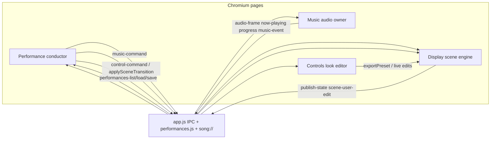
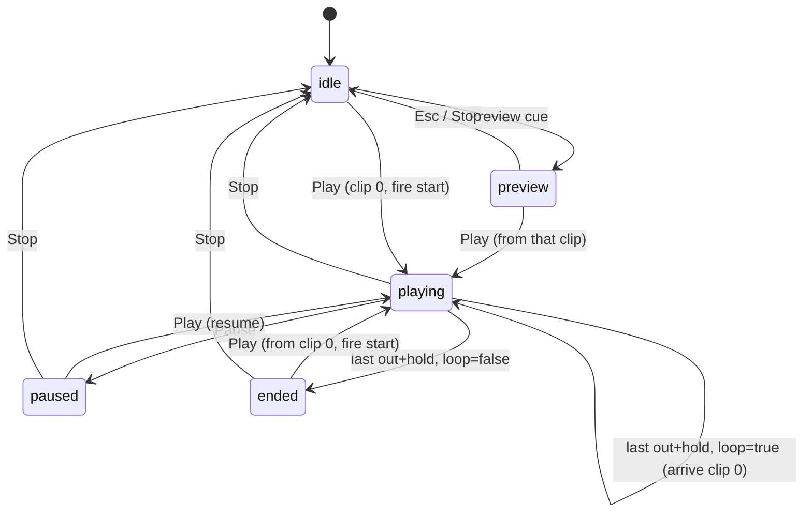

# Performance timeline / showcase control (music_view)

**Status:** Implemented (v1 in tree — iterate in-app)  
**Author:** music_view  
**Date:** 2026-08-13  
**Location:** `docs/roadmap/performance-timeline-plan.md`  
**Target app:** music_view (this repo)  
**Depends on:** Display scene apply (`renderer.js` `applyScenePreset` / `exportScenePreset`), Music transport (`music.js` + `audio-analysis.js`), preset FS (`presets.js`), window/IPC hub (`app.js`, `preload.js`)  
**Related:** [scene-model.md](../architecture/scene-model.md) · [presets.md](../authoring/presets.md) · [system.md](../architecture/system.md) · [audio-pipeline.md](../architecture/audio-pipeline.md) · [commands.md](../reference/commands.md)

---

## Overview

music_view can play one local track and apply one visual look at a time. There is no first-class way to author a **showcase**: a sequence of song *sections* (in/out points) that advance automatically or on a live **Go**, each arriving with a stored visual setup and a controlled audio/visual transition.

This plan adds a **Performance** document (named, versioned, saved like a preset) and a **fourth Electron window** that conducts the show. Music remains the single audio owner; Display remains the scene engine; Controls remains the live look editor. The conductor drives Music (load / seek / dual-deck volumes) and Display (scene snapshots + a new transition runner). Looks are **always snapshotted** into the performance so later edits to a named preset cannot silently change a show.

v1 is a **cue list + inspector + transport**, not a DAW. A compact timeline strip is deferred.

---

## Background & Motivation

### Current state

| Concern | Today |
|---------|--------|
| Windows | Three BrowserWindows in `app.js`: Display (`createDisplayWindow`), Controls (`createControlWindow`), Music (`createMusicWindow`). All use `contextIsolation: true`, `nodeIntegration: false`, shared preload `preload.js` → `window.musicView`. `getRole` comment still says `'display' \| 'controls' \| 'unknown'` (stale vs existing `'music'`). |
| Audio | One `<audio id="audio">` in `music.html`. `music.js` `selectSong` sets `a.src = song.fileUrl` (`song://`), `seekTo(seconds)` assigns `currentTime` (Range/206 already implemented in `registerSongProtocol`). `togglePlay` / `stopPlayback` operate on that single element. Volume slider writes `audio().volume`. |
| Analysis | `audio-analysis.js` `createAudioAnalyser(audioEl)` creates its **own** `AudioContext` and calls `createMediaElementSource` **once** on that element (`source → analyser → destination` plus stereo split). Display never opens a track AudioContext ([audio-pipeline.md](../architecture/audio-pipeline.md)). |
| Looks | Controls save/load via `exportPreset` → `exportScenePreset` on Display, then `savePresetFile` (`presets.js`). Apply is `loadAndApplyPreset` → `applyScenePreset` — a **hard rebuild** of properties on **existing** panels. |
| Apply limitation | `applyScenePreset` matches containers by **role, then runtime id**, and **skips unknown extras** (`// Unknown extra container — skip`). It does not spawn missing panels or prune extras. There is **no** `destroyFloatingContainer`. Runtime ids (`scene.nextContainerId`) are session integers. Role chrome is cached in `scene.songPanels.{cover,info,lyrics,progress}`. |
| Wander | `startWander` is a `setInterval` **random walk** (`wanderAmplitude` / `wanderFrequency`); there is **no** wander phase. `applyContainerUpdates` of `left`/`top` calls `pinContainerLayout`; size changes call `setContainerSize` (bitmap / shader `render()`). |
| Placement | `createFloatingContainer` nudges `left`/`top` via `isPositionAllowed` (up to 30 attempts). |
| IPC | Controls → Display: `sendCommand` → `control-command` → `sendDisplayCommand` (default **8s** timeout, retries while `displayReady`). Music → Display: fire-and-forget `now-playing`, `lyric-focus`, `playback-progress`, `audio-frame`, `empty-lyrics-fx` (main fans out **only to Display**; senders must be `musicWin`). **No inbound Music command channel** and **no `music-ready`.** |
| Library identity | `music-library.js` `listSongs` uses a flat Songs dir; `id` / `name` are the filename; `path` is absolute; `fileUrl` is `song://local/…`. |

### Pain points

1. A live set is currently “pick a song in Music, load a preset in Controls, hope the timing is right.”
2. A single `<audio>` cannot overlap two tracks, so song-to-song crossfade is impossible.
3. `applyScenePreset` pops to the new look; there is no morph, dip, or frame mix.
4. Binding a show to a *named* look preset would drift when that file is edited. Product decision: snapshot the scene into the performance.

---

## Goals & Non-Goals

### Goals

| Goal | Success look |
|------|----------------|
| **A. Sequence of sections** | Author an ordered list of clips (library song + in/out). Play them as a show. |
| **B. Hybrid cues** | Default: each clip starts with a coupled look snapshot + arrival transition. Optional **mid-clip visual-only cues** change the look without a new audio clip. |
| **C. Independent transitions** | Per boundary: audio type/duration/easing/offset and visual type/duration/easing/offset may differ and may overlap. |
| **D. Snapshot looks** | Each look cue stores a full Display scene JSON (same shape as `exportScenePreset`). Capture from live scene or copy from a named preset at authoring time — then **unbind**. |
| **E. Playback modes** | Auto-run on the show clock **and** manual Go/Next. Pause, stop, skip, jump, preview one cue. |
| **F. Smart visuals** | Morph when topology matches; otherwise freeze-outgoing + incoming live mix (fallback crossfade). Cut and dip-to-black always available. |
| **G. Dual-deck audio** | Cut, crossfade, dip-to-silence across two `<audio>` elements. Preload the next file. Analysis and now-playing follow the **incoming** lead. |
| **H. Dedicated window** | Fourth window **Performance** is the conductor. Music/Display/Controls keep their jobs. |
| **I. Persist like presets** | `performances/<stem>.json` via `performances.js` (list/load/save/delete, sanitized stems). |

### Non-goals (v1)

- DAW multi-track editor, automation lanes, clip envelopes drawn on a waveform canvas (a **compact timeline strip** is a later phase).
- Embedding audio files or cover bitmaps inside the performance JSON.
- Live-binding look cues to named presets (would drift).
- Three.js / ARTEF4KT internal parameter interpolation (morph chrome + geometry only).
- True dual-live scene graphs (two full Display trees). Fallback crossfade uses a **frozen outgoing frame**.
- Blackout / panic-to-black as a first-class transport button (v1.1).
- Folding this UI into Music or Controls.
- Cloud sync, collaborative editing, undo history for the performance document.
- Driving Display’s AudioContext or adding a second analysis pipeline.
- Creating containers with **unknown roles** the engine cannot host (those snapshot entries are still skipped).
- A “Go to next look cue” control (Go always advances the **next clip**).

---

## Proposed Design

### Mental model

A **Performance** is a named, versioned document:

- metadata (`name`, timestamps, `settings.loop`)
- ordered **clips** (audio sections of library songs)
- **look cues** (full scene snapshots timed relative to a clip)
- first-class **transitions** (audio and visual, independently)

Default authoring: **one clip ≈ one showcase section**, with one look snapshot at clip start (`offset: 0`). Hybrid extra: more look cues at `t = clipIn + offset`.

```
Performance
  settings.loop                 // false = stop after last clip out+hold
  clip[0]  song + [in, out] + volume + hold/loop flags
     lookCue[0]  offset=0  scene snapshot + visualTransition   ← coupled default
     lookCue[1]  offset=18  scene snapshot + visualTransition  ← optional mid-clip
     audioTransition  (used when *arriving at* this clip; clip[0] = fade-in from silence)
  clip[1]  …
```

A **transition** is stored on the **arriving** clip (audio) and on the **arriving** look cue (visual). They may start at different offsets relative to the clip boundary and may overlap in time.

`settings.endBehavior` is **not** a field. Loop vs stop is only `settings.loop` (boolean). After the last clip’s `out + holdAfter`: if `loop` then treat as arrival at clip[0] (use clip[0] transitions); else `status = ended`.

---

### Ownership

| Layer | Owner | Performance’s relationship |
|-------|--------|----------------------------|
| Show document, cue list, show clock, Go | **Performance window** (conductor) | Source of truth for *what happens next* |
| `<audio>` / Web Audio / analysis / library / lyrics | **Music** | Conductor commands transport; library remains visible |
| Scene graph, WebGL, capture, apply | **Display** | Conductor sends `applySceneTransition` / preview apply |
| Live look editor | **Controls** | Stays usable; mid-show edits do **not** rewrite snapshots |
| FS + IPC hub | **Main** (`app.js`) | New `performances.js` handlers; fan-out; window lifecycle |

**Do not** put the conductor in Music or Controls. If the Performance window is closed mid-show: **pause audio, freeze visual transition, `setShowDriving(false)`, release Music** (no ghost conductor in main). If Display closes, existing `app.js` already closes sibling windows — include Performance in that teardown.

If **Music** closes mid-show: conductor has no audio owner. Performance must `status = idle`, publish `inShow: false`, cancel visual transitions (`finishSceneTransition` if Display is still up), and fail closed. Do not keep a show clock running.



#### Music UI while `showDriving` (K17)

While `setShowDriving({ on: true })`:

- Persistent **“Performance driving playback”** banner + **Take over** button.
- **Disable** local Play / Pause / Stop, seek slider, and lyric-line seek. Volume slider stays live (writes `mixGain`, not element `.volume`).
- `selectSong` is blocked. Library remains browsable.
- **Take over** (`music-event: userTakeover`): `setShowDriving(false)`, Performance → `idle`, leave decks/scene as they are, restore Music transport.
- **Space** with Performance focused = show play/pause. **Space / Stop with Music focused** while driving publishes **`music-event: showAction { action: 'togglePlay' | 'stop' }`** (`musicWin` allowlist). Performance runs the same handlers as its own Space / Stop. There is **no** inbound `forwardShowAction` / `sendShowAction`. Do not toggle the raw `<audio>` locally.

#### Stale snapshots (not inferred from `publish-state`)

`publishSceneState` is coalesced at 50 ms and also fires on **wander ticks** and the morph runner. Performance must **not** deep-compare `onState` to the cue snapshot (false positives, and `getState` attaches the shader catalog).

Display emits **`scene-user-edit`** only from **authoring** `sceneCommand` cases:

- `updateContainer`, container shader/uniform/modulator ops
- global and per-container postprocess stack ops
- `updateBottomPanel`
- ARTEF4KT `setArtef4ktSettings` / `loadArtef4ktPreset`
- Controls `applyPreset` / `loadPreset` while a show is running

**Not** emitted for: wander, morph/`applySceneTransition` runner, now-playing / lyrics / progress / `applyAudioFrame`, selection-only `selectContainer`.

Main fans `scene-user-edit` to Performance. Performance marks the **active look cue** stale (dot + tooltip). Stale does not auto-recapture. Morph and snapshot apply never stale.

---

### Window / boot

Add `createPerformanceWindow()` in `app.js` next to the other three:

- Same `webPreferences`: `preload: preloadPath()`, `contextIsolation: true`, `nodeIntegration: false`.
- Size: 400×720 (Music/Controls density), `minWidth` 320, `minHeight` 480, resizable.
- `loadFile('performance.html')`.
- `get-window-role` returns `'performance'` when `win === performanceWin`. Update `preload.js` `getRole` typedef to `'display' | 'controls' | 'music' | 'performance' | 'unknown'`.
- `createWindows()` creates Display, Controls, Music, **then Performance**.
- `displayWin` `closed` also closes Controls, Music, **and Performance** (same as today’s sibling teardown).

**Placement algorithm** (laptop work areas will not fit Music + Display + Controls + a 400px fourth column):

```
work = primaryDisplay.workArea
W = 400, H = min(720, work.height)

1. Prefer: x = controlWin.x + controlWin.width + 12, y = controlWin.y
   If x + W <= work.x + work.width → use it (clamp y into work).
2. Else: stack under Music, same x as musicWin:
   x = musicWin.x
   y = musicWin.y + musicWin.height + 12
   If y + 240 > work.y + work.height (not enough leftover height):
      y = max(work.y, work.y + work.height - H)
      x = clamp(musicWin.x, work.x, work.x + work.width - W)
3. Always clamp the final rect into work. Overlap with Display is acceptable
   only after both side columns are exhausted; prefer overlapping Music/Controls
   chrome over covering the portrait stage.
```

New files (mirror Music/Controls IA — calm, one-domain chrome; do **not** copy obsolete markup from `docs/roadmap/history/ui-overhaul-plan.md`):

- `performance.html`
- `performance.js`
- `performance.css`

---

### Conductor / clocks

#### State machine

Persist and publish **one** `status` plus transition **flags**. Do not use `transitioning` as an enum value.

```text
status:  idle | preview | playing | paused | ended
flags:   { audioTransitionId: string|null, visualTransitionId: string|null }
         { visualKind: 'arrival' | 'midclip' | null }
```

`show-state` sends `status`, the flags, `inShow: status === 'playing' || status === 'paused'`, clip/look ids, showTime, `uAudio`, `uVisual`.



| Clock | Definition | Pauses? |
|-------|------------|---------|
| **Show clock** | Elapsed seconds while `status === 'playing'`. | Yes on Pause. Stop resets to 0. |
| **Clip clock** | Lead deck `currentTime` (song position). Look cues: `fireAt = clip.in + lookCue.offset`. | Yes (audio paused). |
| **Transition `u`** | Per active `audioTransitionId` / `visualTransitionId`, `u ∈ [0,1]`, advanced with `dt` only while `playing`. | Pause freezes both envelopes. |

**Fired-cues rule:** Performance keeps `firedLookCueIds: Set` for the **current clip**. A look cue fires at most once per visit to that clip.

- **First Play** from `idle`/`ended`, and **Play after Stop**: clear the set; fire the starting look (`offset === 0`, or inherit); start clip[0] (or current after Stop) audio.
- **Pause → Play**: do **not** re-fire look cues already in the set; resume decks and `u` in place.
- **Arrive at a clip** (auto, Go, loop-back): clear the set, then fire that clip’s `offset === 0` look (unless inherit).
- **Jump / Prev / Skip**: clear the set; apply the look for the landing time (see table); do not replay mid-clip cues already behind the landing time.

#### Clip notify vs freeze (K23 — notify ≠ freeze)

Music owns the sample clock. Conductor does **not** decide `out`, look-cue times, or audio-lead times by watching throttled `playback-progress` (~20 Hz). **`playback-progress` is UI-only** (Display progress bar + Performance transport readout).

**`setClipBounds` never pauses the element and never zeros gains.** It only arms timed `music-event`s. Looping is **only** `setClipLoop` (do not pass `loopUntilGo` on bounds).

On each visit to a clip the conductor sends:

```js
setClipBounds({
  deck,
  in,
  out,
  holdAfter,                 // for holdEnd only; does not mute
  audioOffset,               // clip.audioTransition.offset (may be negative)
  lookCues: [ { id, offset } ],  // mid-clip + offset-0 (offset-0 may already have fired at arrive)
})
```

Music emits **once per armed time** (element `timeupdate` / rAF vs `currentTime`, not IPC poll from Performance):

| Event | When | Conductor does |
|-------|------|----------------|
| `clipBoundary { which: 'out', t }` | `currentTime >= out` | Informational / last-clip `ended` path. **Does not** start a fade by itself if `audioLead` is also armed. |
| `clipBoundary { which: 'holdEnd', t }` | `out + holdAfter` when `holdAfter > 0` | If **no** audio transition is running: this is `T_arrive`. Then apply **positive** `audioOffset` (wait, incoming paused at `in`) or start fade if `audioOffset === 0`. |
| `clipBoundary { which: 'audioLead', t }` | `T_arrive + audioOffset` | Start `startAudioTransition` (incoming play + envelope). |
| `lookCue { id, offset, t }` | `in + lookCue.offset` | Fire that visual cue if not in `firedLookCueIds`. |

**`T_arrive` definition:** `out` when `holdAfter === 0`; `out + holdAfter` when `holdAfter > 0`.

**Hold (`holdAfter > 0` and no audio transition running):** on `out`, the **conductor** zeros audible deck gains (`setDeckGain` both 0). The outgoing element **may keep sitting at / past `out`** (Music does not freeze it). Last look stays on screen. Incoming stays loaded/paused at `in`. On `holdEnd`, continue with the audio-offset rule below.

**Crossfade / dip (`audioLead` or immediate arrive):** outgoing **keeps playing past `out`** so there is a tail to fade. Music does **not** pause or mute at `out`. After `startAudioTransition` completes or `cancelAudioTransition`, Music pauses the **outgoing** deck.

**Audio offset:**

| `audioOffset` | After `T_arrive` |
|---------------|------------------|
| `0` | `audioLead` coincides with `T_arrive`. Start authored fade immediately. |
| `> 0` | Silence (gains 0; incoming paused at `in`; last look held) until `audioLead`, then start the authored fade. |
| `< 0` | `audioLead` fires **before** `out` (at `out + offset`, still inside the previous clip). Start fade while outgoing is still in its in–out region. Go (below) discards remaining pre-roll. |

If the file `ended` before `out`, Music still emits `out` (then `holdEnd` / remaining `audioLead` / remaining `lookCue`s that have not fired, using wall time from the last known `currentTime` or immediately if the time is already past).

**`setClipLoop { deck, in, out, on }`:** Music-owned `[in, out]` loop (`seek` back to `in` on `out` in-element). `on: false` when Go/advance clears it. When loop is on, Music still emits `lookCue`s each pass (conductor’s fired-set is **cleared on each loop wrap** — treat wrap as a new visit only for mid-clip looks if we stay on the same clip; **v1: do not re-fire looks on loop wrap**, keep the last look). Do **not** emit `out`/`holdEnd`/`audioLead` that would advance the show while loop is on.

#### First-clip audio

Clip[0].`audioTransition` is a **fade-in from silence** on the first Play / Play-after-Stop / loop-back to clip 0. Incoming deck starts at `in` with gain 0 (unless `type: 'cut'`). There is no outgoing file. Treat outgoing gain as already 0.

#### Auto-run

While `playing` and `loopUntilGo` is false on the current clip: play until Music emits `audioLead` (after `out` / optional `holdEnd` / offset). That event starts the next clip’s `audioTransition` + first look’s `visualTransition`. Last clip’s `out`+`holdEnd` with `settings.loop === false` → `ended` (no `audioLead` for a following clip).

#### Manual Go

**Go advances the next clip, not the next look cue.** Intentional. There is no “Go to next look” in v1; mid-clip looks fire on clip time only.

**When Go is ignored** (status line + one `[performance] GO ignored — …` log):

- `audioTransitionId != null` (any audio fade), **or**
- `visualTransitionId != null` **and** `visualKind === 'arrival'`

**Mid-clip visual morphs do not block Go.**

On an accepted Go:

1. Remaining `holdAfter` becomes 0.
2. Remaining time-to-out is discarded (lead may still be mid-file).
3. Start the **next** clip’s authored audio + arrival-visual transitions **immediately**.
4. **Negative offsets:** do not wait for the authored pre-roll. Start the remaining transition now. Keep the authored `duration` unless it would exceed remaining media on the incoming file (`duration' = min(duration, incoming.duration - incoming.in)`). Do not stretch.
5. If there is no next clip: if `settings.loop` arrive at clip[0]; else `ended`.

#### Transport decision table

| From | Action | Audio | Visual | Fired set | Result status |
|------|--------|-------|--------|-----------|---------------|
| `idle` / `ended` | **Play** | Load clip[0] (or current if ended→prefer clip[0]), seek `in`, `setClipBounds`, fade-in via clip[0].`audioTransition` from silence | Apply starting look (`offset === 0`) with that cue’s visual transition | Clear, then add starting look | `playing` |
| `paused` | **Play** | Resume both decks; resume audio envelope | Resume visual `u` | Unchanged | `playing` |
| `preview` | **Play** | Same as first Play but from the **previewed clip** (fade-in from silence using that clip’s `audioTransition`) | Keep previewed look (already applied); do not re-transition unless inherit | Clear, add the look already showing | `playing` |
| `playing` / `paused` | **Pause** | Pause both decks | Freeze `u` | Unchanged | `paused` |
| any except `idle` | **Stop** | `pauseAll`, seek lead to current clip `in`, cancel audio transition (snap incoming if mid-fade) | Leave scene; cancel visual runner (leave pixels as-is) | Clear | `idle` (show clock 0; stay on that clip index) |
| `preview` | **Esc** or **Stop** | Pause, do not change library lead beyond the previewed load | Leave previewed look | — | `idle` |
| `playing` or `paused` (not blocked) | **Go** | Same as playing: start next clip arrival immediately (see above). If paused, decks resume as part of the arrival. | Arrival visual of next clip | Clear on arrive | **`playing`** (Go from paused unpauses) |
| `playing` or `paused` (blocked) | **Go** | No-op | No-op | Unchanged | unchanged; status line |
| `playing` / `paused` | **Skip** | Hard-cut to next clip `in` (`cancelAudioTransition { snap: 'incoming' }`). **Last clip:** same as Go-on-last-clip (`settings.loop` → clip[0] cut, else `ended`). | `applySceneTransition { mode: 'cut' }` of landing starting look | Clear, add that look | `playing` if a next clip exists; `ended` if last and not looping |
| any | **Prev** / **Jump to clip** | Hard-cut to target clip `in` | Cut starting look | Clear, add that look | keep playing/paused |
| any | **Jump mid-clip** | Seek to `t` | Cut **last** look cue with `offset <= t - in` | Set = all cues with `offset <= t - in` | keep |
| `idle` / `paused` / `ended` | **Preview cue** | `loadDeck` + `seekDeck` to `in` (or cue offset); **paused**; `setShowDriving(false)` for preview or a `preview` flag so Music does not arm bounds | `applySceneTransition({ mode: 'cut', scene })` with spawn/prune **on** — **not** `applyScenePreset` | — | `preview` |

`loopUntilGo` (default `false`): Music `setClipLoop` on the lead. Auto-run does not advance. **Go** turns loop off and arrives at the next clip (with transitions).

**Skip** is a **v1 secondary transport button** (next to Go; not optional). Keyboard: none required beyond `[` / `]` jump-cut.

---

### Audio engine (Music)

#### Why A/B decks

`seekTo` / a single element cannot overlap two files. Web Audio allows only **one** `MediaElementSource` per element for the life of the context (`audio-analysis.js` `ensureGraph`).

#### Mandatory graph (one AudioContext)

Music owns the mixer. **`createAudioAnalyser` must not construct a second `AudioContext`.** PR 2 refactor:

1. Create `#audio-a` and `#audio-b` in `music.html` **before** any analyser init. Keep `#audio` as a **JS alias to the lead element** until PR 5 is green (feature flag `DUAL_DECK=true` but alias stays so leftover `audio()` callers do not break). Delete the single-element path only in **PR 7** after the conductor is proven.
2. One `AudioContext`. Two `createMediaElementSource` calls (once each), two deck `GainNode`s, one `mixGain` → `destination`.
3. Pin **`audioA.volume = 1` and `audioB.volume = 1` always.** The Music slider writes **`mixGain.gain`** only. Fades write deck gains only. Never multiply element `.volume` × GainNode.
4. Analyser grows **`retarget(sourceNode)`** (reconnect analyser + stereo split to that `MediaElementSource`; do not call `createMediaElementSource` again). Default tap = **incoming/lead** source, not `mixGain`.
5. If the second `createMediaElementSource` throws: stay cut-only on one deck; surface a Music status error.

```
audioA.volume = 1 → MES_A → gainA ─┐
audioB.volume = 1 → MES_B → gainB ─┼→ mixGain (Music slider) → destination
                                    └→ analyser.retarget(MES_lead)
```

**Analysis during overlap:** `retarget` the **incoming** MES as soon as `startAudioTransition` runs (incoming gain may still be 0). Do not mix FFTs.

**Now-playing / lyrics / detectors:** `startAudioTransition` **atomically** (same turn, before returning):

1. Set lead = incoming deck.
2. `retarget(MES_incoming)`.
3. `resetDetectors()`.
4. Load lyrics + `publishNowPlayingToDisplay` for the incoming song.
5. Start the gain envelope; `play()` incoming.

Do **not** expose a separate `setLead` + `publishLeadMetadata` race for the show path. `setLead` remains for tests / Take over. `publishLeadMetadata` is internal to Music.

`playback-progress` stays backward compatible and adds `lead`, optional deck times, `showDriving`, `clipId`. Main fans this (and `now-playing`) to **Display and Performance**. The conductor **must not** use it to fire `out`, `audioLead`, or look cues — **UI-only** (K23).

#### `music-ready` handshake

Copy `display-ready` / `sendDisplayCommand` **including readiness**:

- Music calls `musicView.notifyMusicReady()` after `onMusicCommand` is registered (end of `music.js` boot).
- Main `musicReady` flag; `did-start-loading` clears it.
- `sendMusicCommand` retries while `!musicReady` (same 250 ms × 12 pattern). Without this, Performance commands at startup are dropped.

Timeout: **8s** for load/seek. `startAudioTransition` returns immediately `{ ok, transitionId }`.

#### Transition types (audio)

| Type | Behavior |
|------|----------|
| `cut` | Incoming at clip volume immediately; outgoing gain 0 and pause. |
| `crossfade` | Over `duration`, outgoing `volOut * (1-e(u))`, incoming `volIn * e(u)`. |
| `dip-to-silence` | Outgoing → 0 over first half; incoming 0 → vol over second half. |

`easing`: `linear` (`u`) | `ease-in-out` (`u*u*(3-2*u)`).

Per-clip `volume` (0–1, default 1) is the incoming target.

**Scheduling:** audio transition for clip N starts on **`audioLead`**, not on `out`. Incoming seeks to `clip.in` **before** `play()`. Outgoing **keeps playing** past `out` for the fade tail (Music does not freeze at `out`). If outgoing file ends first, cut the tail. After the envelope finishes, pause outgoing.

**Preload (conductor, PR 5):** when lead is within `max(2.0, audioDuration + 0.5)` seconds of `out` (or when Go is likely), `preloadDeck` the next clip on the idle deck: `preload = 'auto'`, `loadedmetadata`, seek `in`, stay paused. On miss: status line `preload miss on clip N` and still attempt load at arrival (may hitch). `song://` already serves Range/206.

#### Inbound Music commands

```
Performance: musicView.sendMusicCommand(cmd, payload)
  → main: music-command          (allowlist: performanceWin; also musicWin for self-test)
  → music: music-command { requestId, command, payload }
  → music: musicView.replyMusicCommand(requestId, result)
  → main: music-command-result
```

| Command | Payload | Result |
|---------|---------|--------|
| `getTransportState` | — | decks, lead, playing, times, showDriving |
| `setShowDriving` | `{ on, performanceName? }` | banner; disable local transport except volume + Take over |
| `loadDeck` | `{ deck: 'A'\|'B', relPath }` | `{ ok, duration, fileUrl }` — **main/Music resolve** via `resolveSongsDir()` + same prefix check as `music-load-song`. Reject raw `fileUrl` / absolute paths from the renderer. |
| `seekDeck` | `{ deck, time }` | existing `seekTo` per element |
| `playDeck` / `pauseDeck` / `pauseAll` | `{ deck? }` | |
| `setDeckGain` | `{ deck, gain }` | instant |
| `startAudioTransition` | `{ incomingDeck, outgoingDeck?, type, duration, easing, volIn, volOut, songRelPath }` | `{ ok, transitionId }` — **atomic** lead + metadata + envelope. `outgoingDeck` omitted for clip[0] fade-in. |
| `cancelAudioTransition` | `{ snap?: 'incoming'\|'outgoing' }` | hard-set gains |
| `preloadDeck` | `{ deck, relPath, time }` | load + seek, paused |
| `setClipBounds` | `{ deck, in, out, holdAfter, audioOffset, lookCues: [{ id, offset }] }` | **Notify only** — arm `out` / `holdEnd` / `audioLead` / `lookCue`. Never pause or zero gains. No `loopUntilGo` field. |
| `setClipLoop` | `{ deck, in, out, on }` | Music-owned `[in,out]` loop (only owner of looping) |
| `setLead` | `{ deck }` | tests / Take over only |

`listSongs` stays on existing invoke APIs.

`music-event` kinds: `ended`, `deckReady`, `transitionDone`, `clipBoundary` (`out` \| `holdEnd` \| `audioLead`), `lookCue`, `showAction` (`togglePlay` \| `stop`), `userTakeover`, `preloadMiss`. **No** inbound `forwardShowAction`.

---

### Visual engine (Display)

Today `applyScenePreset` / `loadAndApplyPreset` is the **cut** path for Controls (spawn/prune **off**). Add a **scene transition runner** in `renderer.js` (module-local).

New command **`applySceneTransition`** (additive; do **not** silently overload `applyPreset`):

```js
{
  mode: 'cut' | 'dip' | 'morph' | 'crossfade' | 'auto',
  duration: 1.2,          // seconds; 0 ⇒ cut
  easing: 'linear' | 'ease-in-out',
  dipColor: '#000000',    // dip only
  morphThreshold: 0.65,   // auto only
  kind: 'arrival' | 'midclip',  // echoed in show-state via Performance; Display may ignore
  scene: { containers, postprocess, bottomPanel, background },
  name: 'optional label'
}
```

Returns immediately `{ ok, modeUsed, matchScore, transitionId }`. Runner advances on Display’s rAF / postprocess loop. **Pause:** `setSceneTransitionPaused { paused }`. **Flush:** `finishSceneTransition` (Skip).

`sendDisplayCommand` 8s timeout is fine because apply **must not block** for the duration.

If PR 4 (morph/crossfade) has not merged, `mode: 'auto'|'morph'|'crossfade'` **degrades to `cut`** (or `dip` if the author forced dip). The conductor is usable with cut/dip only.

#### Prerequisite: snapshot apply + container lifecycle

There is no destroy path today. Performance spawn/prune requires new hooks.

**`destroyFloatingContainer(state)`** (new):

1. `stopWander(state)`
2. `destroyContainerPostprocess(state)`
3. `unmountArtef4ktFromContainer(state)` if present
4. `clearShader(state)`
5. `state.element.remove()`
6. Splice out of `scene.containers`
7. If `scene.songPanels.* === state`, set that slot to `null`

**`rebindSongPanels()`** (new): set `scene.songPanels.cover|info|lyrics|progress` from `findContainerByRole` for those four roles. If the host **element is new** (spawn replaced it), stamp the **same role class names as `createSongInfoPanels`** (`song-cover-panel`, `song-info-panel`, `song-lyrics-panel`, `song-progress-panel` — CSS and progress hit-testing key off these, not off `setupSong*` alone), then re-run `setupSongInfoBlock` / `setupSongLyricsBlock` / `setupSongProgressBar` and re-apply the last now-playing / lyrics / progress payloads (Display already has that runtime state). `applyAudioFrame` stays role-wired; after rebind, viz roles pick up the next frame.

**`createFloatingContainer(..., { skipPlacementSearch: true })`:** honor stored `left`/`top` (only `clampContainerInPanel`). **Required** for snapshot spawn — the default 30-attempt `isPositionAllowed` nudge would miss authored pixels.

**`applySceneSnapshot(scene, { spawnMissing, pruneExtra, fadeUnmatched })`**

- Match order: **unique role** (`song-cover`, `song-info`, `song-lyrics`, `song-progress`, `audio-scope`, `audio-history`, `audio-beat`, `artef4kt`) → **`snapshotId`** → leftover by array order.
- **Unknown roles are still skipped** (non-goal). No factory for roles the engine does not host.
- `spawnMissing: true` — `createFloatingContainer` with `skipPlacementSearch: true`; assign stored `snapshotId`; then role setup + `rebindSongPanels`.
- `pruneExtra: true` — `destroyFloatingContainer` leftovers. Morph: fade opacity then destroy.
- Persist `snapshotId` (UUID at capture). Runtime `id` stays session-local.
- **K24:** every snapshot container **must** persist resolved `left` / `top` / `width` / `height` **and** `relative` (object or `null`). Today’s `exportScenePreset` writes **pixels only** and drops `relative` — do **not** store that output unchanged. Performance capture is a superset: start from `exportScenePreset`, then copy `state.relative` from the live container (or from the imported preset JSON), mint `snapshotId`. If the live box was drag-pinned and has no helpers, write `"relative": null`. Morph/lerp uses **pixels** via `morphSetGeometry`; do not re-run `belowRole` mid-transition. Recapture or a future stage-size change may re-resolve from `relative` when it is non-null.
- Still exclude covers, lyrics, analysis, Controls chrome.

Controls `applyPreset` continues to call snapshot apply with **spawn/prune off** (today’s skip-unknown behavior). Performance always passes spawn/prune **on**.

Cut mode = `applySceneSnapshot` + no runner.

#### Modes

**1. cut** — `applySceneSnapshot` (spawn/prune on for Performance).

**2. dip** — overlay toward `dipColor` over `duration/2` → `applySceneSnapshot` → fade overlay out. Overlay sits above `#postprocess-canvas`. Feedback textures reset on apply — acceptable.

**3. morph** — single live scene, per-frame lerp. **Do not** call `applyContainerUpdates` or `applyScenePreset` every frame.

**Wander:** `stopWander` on all containers at morph start. Do **not** lerp a wander “phase” (there isn’t one — `startWander` is a random walk). Optionally lerp `wanderAmplitude` / `wanderFrequency` into state only. At `u === 1`, set incoming `wander` flags and `startWander` if incoming wants wander. Per-frame `left`/`top` writes must not fight `setInterval`.

**Geometry path — `morphSetGeometry(state, left, top, width, height)` (new):**

- Write CSS `left`/`top`/`width`/`height` and `state.left/top/width/height`.
- **Do not** call `pinContainerLayout`.
- **Do not** call `setContainerSize` every frame (it resizes 2D bitmaps and `shaderRenderer.render()`). Throttle `setContainerSize` / `resizeArtef4ktOnContainer` to ~4 Hz **or** only at `u === 1`.
- Shader canvases CSS-fill the box; WebGL resizes from client size on its own rAF.

**Float area:** freeze `includeInFloatArea` at the **outgoing** value until commit (`u === 1`). Lerp `heightRatio` and `color`, but compute all container pixel lerps in the **outgoing** `getFloatAreaSize()` space. At commit, apply incoming `includeInFloatArea` / `heightRatio` and one `clampContainerInPanel` pass.

**Default discrete rule:** fields not listed as continuously lerped **step at `u >= 0.5`**: `distancing`, `connect`, `attachToRole`/`attachToId`, `anchorDistance`, `imageMode`, `progressTimeMode`, `textAlign`, `padding`, `labelCorner`, `labelEnabled`, font family/weight, dash arrays, `includeInFloatArea` (at commit, not 0.5 — see freeze above).

| Property | Rule |
|----------|------|
| Geometry | Lerp pixels via `morphSetGeometry`. Do not re-run `belowRole`. |
| Style colors / opacities / `lineWidth` | Lerp (sRGB hex → rgb). |
| `layer` | Lerp then round; z-index each frame. |
| Wander | Disabled during morph (above). |
| Bottom strip | Lerp `color`, `heightRatio`; freeze `includeInFloatArea`. |
| Container fill uniforms | Lerp numbers/vecs if **same** `shaderId`. |
| Global FX | Layers matched by **index + shaderId**: lerp uniforms. |
| **Container PP** | Same as global FX: match `containers[].postprocess.layers` by index + `shaderId`; fade unmatched `u_intensity` to 0 then swap; fade new layers in. |
| Unmatched containers | Spawn at opacity 0 (`skipPlacementSearch`); fade in. Extras fade out then `destroyFloatingContainer`. |
| ShaderId change on a match | Fade fill intensity 0 → `applyContainerShader` once → fade in. Not a program lerp. |
| ARTEF4KT | Morph chrome + geometry only. If `embed.settings` / `settingsId` differ: opacity-fade the host canvas, `applySettings` or remount **once** at `u >= 0.5`. No Three.js interpolation. |
| Modulators | Below. |

**Modulator rule:**

- Always lerp **base** uniforms.
- Matched float key, same `source` **and** `clock`: lerp `offset`, `amp`, `rate`; **keep outgoing `phase`.**
- Else: fade outgoing `amp` → 0 on `[0, 0.5]`, swap spec at 0.5, fade incoming `amp` on `[0.5, 1]`.
- **`clock: 'song'`:** lead switch jumps song time to incoming `in`. Do **not** keep outgoing phase across a song-clock change — treat as “types differ” (fade-swap at 0.5) even if `source` matches. Live analysis uniforms are not lerped.

**4. crossfade (fallback)** — freeze outgoing + incoming live:

1. `drawImage` `#postprocess-canvas` into an overlay canvas whose **width/height match the postprocess canvas backing store and CSS box** (Display is `1080×1920 * scale` to the work area — **not** hardcoded 1080×1920). `preserveDrawingBuffer: true` on that canvas (`shaders.js`) makes this feasible.
2. `applySceneSnapshot` incoming (cut).
3. Mix `freeze * (1-e(u)) + live * e(u)` for `duration`.
4. Drop overlay.

Outgoing wander/viz freeze for the fade. Accepted.

#### Match heuristic (`auto`)

Let `A` = outgoing live snapshot, `B` = incoming scene. Ignore null roles in Jaccard.

| Term | Score | Weight |
|------|-------|--------|
| Role Jaccard | `\|R_A ∩ R_B\| / \|R_A ∪ R_B\|` | 0.40 |
| Count ratio | `min(nA,nB) / max(nA,nB)` | 0.10 |
| Global FX topology | 1 if same length and same `shaderId` sequence; else LCP / max(len) | 0.30 |
| Matched-container fill | fraction of matched pairs with same `shaderId` (both artef4kt counts as match) | 0.20 |

`matchScore ∈ [0,1]`. **`auto` uses morph iff `matchScore >= morphThreshold` (default 0.65).** Author may force any mode.

Almost every current look shares the same eight boot roles, so Jaccard and count are often ~1. **FX topology (0.30) + fill (0.20) decide.** Same roles + different fills still **can** morph (chrome lerp + fill fade-swap); that is intentional, not a hidden extra crossfade — document it in the inspector when `modeUsed === 'morph'` and fill < 1.

**Worked examples** (threshold 0.65):

| Case | Jaccard | Count | FX | Fill | Score | `auto` |
|------|---------|-------|----|------|-------|--------|
| Same 8 roles, same CRT stack, same fills | 1.00 | 1.00 | 1.00 | 1.00 | **1.00** | morph |
| Same 8 roles, `default` 1-layer vs `toolkit-liquid-stage` 5-layer no shared prefix | 1.00 | 1.00 | 0.00 | 1.00 | **0.50** | **crossfade** |
| Same 8 roles, same 3-layer stack, 2/8 fills differ (scope + beat shaders) | 1.00 | 1.00 | 1.00 | 0.75 | **0.95** | morph (those 2 fade-swap) |
| Same 8 roles, stacks share only first of 4 layers, all fills match | 1.00 | 1.00 | 0.25 | 1.00 | **0.675** | morph (barely) |
| Incoming missing artef4kt + both viz stacks empty | 0.88 | 0.88 | 1.00 | 1.00 | **0.95** | morph (artef4kt fades out) |

Extract `scoreSceneMatch(a, b)` as a **pure function** in `scene-match.js` (Node-requireable). PR 4 adds `scripts/test-scene-match.js` run with `node --test` (no extra deps). Cases above are the fixtures.

#### Output gain vs existing FX

Overlay mix sits **after** `#postprocess-canvas`. Morph mutates the live graph *before* capture.

---

### Performance window UX (v1)

**Layout** (single column, Controls-like density):

1. **Header** — performance name, dirty dot, file stem.
2. **Transport** — Play / Pause / Stop show · **Go** · **Skip** · Prev. Show time + current clip title + in/out + `status`.
3. **Document** — New / Open / Save / Save As / Delete / Refresh (PR 1 disk API; Save is in the UI PR, not a later follow-up).
4. **Cue list** — clips in order; drag-reorder; expand to mid-clip look cues. Error badge if song missing or snapshot corrupt. Stale dot from `scene-user-edit`.
5. **Inspector** — song picker (`listSongs`); numeric in/out; volume, holdAfter, loopUntilGo; audio transition; look Capture current (`exportPreset`) / Import named preset (`loadPresetFile`, store `scene`, `sourcePreset` provenance only) / Inherit; visual transition (`auto|morph|crossfade|cut|dip`).
6. **Status line** — missing assets, driving, stale, **`GO ignored — audio 0.4s left`** / **`GO ignored — arrival visual 0.4s left`**, **`preload miss on clip 3`**.

**Keyboard** (Performance focused, not in an input):

| Key | Action |
|-----|--------|
| Space | Play / pause **show** |
| Enter or G | Go |
| `[` / `]` | Prev / next clip (**jump cut**, not Go) |
| Esc | Blur; if `preview`, exit to `idle` |

Document in `docs/reference/keyboard-shortcuts.md` when implementing.

**Safety:** Stop = pause + seek to clip in + stay. **Blackout** = v1.1.

**Missing song / corrupt snapshot:** row error; Play/Go that would land there **fails closed**.

---

### IPC (additive)

Follow [system.md](../architecture/system.md) / `preload.js`. Prefer new names over overloading `applyPreset`.

| Channel | Direction | **Allowlist (sender)** | Purpose |
|---------|-----------|------------------------|---------|
| `performances-list/load/save/delete` | invoke | any window (same as presets) | Disk |
| `music-command` / `music-command-result` | Performance → Music | **`performanceWin`** (and `musicWin` for self-test). **Reject Controls.** | Transport |
| `music-ready` | Music → main | `musicWin` | Handshake |
| `music-event` | Music → Performance | **`musicWin` only** | `clipBoundary`, `lookCue`, `showAction`, `userTakeover`, `preloadMiss`, … |
| `control-command` | any → Display | unchanged (already open) | `exportPreset`, `applySceneTransition` |
| `show-state` / `publishShowState` | Performance → Display, Controls, Music | **`performanceWin` only** | `inShow`, clocks |
| `scene-user-edit` | Display → Performance | **`displayWin` only** | Stale mark |
| `playback-progress` / `now-playing` | Music → Display **and** Performance | `musicWin` (existing) | Clip clock + metadata |

`relPath` resolution: **only** `resolveSongsDir()` + prefix check (same as `music-load-song`). Performance JSON must **never** store an absolute path as the oracle. Ignore a leftover `path` key on load. `fileUrl` is computed in Music via `songFileUrl`, not taken from the document.

`preload.js` additions: `listPerformances`, `loadPerformanceFile`, `savePerformanceFile`, `deletePerformanceFile`, `sendMusicCommand`, `onMusicCommand`, `replyMusicCommand`, `notifyMusicReady`, `publishShowState`, `onShowState`, `onMusicEvent` / `publishMusicEvent`, `onSceneUserEdit`.

---

## API / Interface Changes

### Display `sceneCommand` (new cases)

```text
applySceneTransition     { mode, duration, easing, scene, dipColor?, morphThreshold?, kind? }
setSceneTransitionPaused { paused }
finishSceneTransition    { applyIncoming?: true }
exportPreset             unchanged
applyPreset / loadPreset unchanged — spawn/prune off
```

Return shape stays `{ ok, error?, state? }`. Extra fields (`modeUsed`, `matchScore`, `transitionId`) allowed.

### Music (new)

Inbound table above. `notifyMusicReady`. Outbound `music-event`, richer `playback-progress`.

### Main

- `createPerformanceWindow` + placement algorithm + four-window teardown
- `get-window-role` includes `performance`
- `performances-*`
- `sendMusicCommand` with **`musicReady` retry** (not only a pending map)
- Allowlists on new channels
- Fan-out `show-state`, `scene-user-edit`, music publishes to Performance

---

## Data Model Changes

### On-disk envelope (`performances/<stem>.json`)

Mirror presets: `version`, `name`, `createdAt`, `updatedAt`, body. **Schema version starts at `1`.** `performances.js` rewrites `version` and `updatedAt` on save; sanitizes stem with `sanitizePresetName` (`^[a-zA-Z0-9][a-zA-Z0-9_-]{0,63}$`). No reserved `default`.

```json
{
  "version": 1,
  "name": "Friday Showcase",
  "createdAt": "2026-08-13T00:00:00.000Z",
  "updatedAt": "2026-08-13T00:00:00.000Z",
  "settings": {
    "loop": false
  },
  "clips": [
    {
      "id": "clip_01HZX…",
      "song": {
        "relPath": "Artist - Track.mp3",
        "title": "Track",
        "artist": "Artist",
        "duration": 243.18
      },
      "in": 12.0,
      "out": 48.5,
      "volume": 1.0,
      "holdAfter": 0,
      "loopUntilGo": false,
      "audioTransition": {
        "type": "crossfade",
        "duration": 1.5,
        "easing": "ease-in-out",
        "offset": 0
      },
      "lookCues": [
        {
          "id": "look_01HZX…",
          "offset": 0,
          "lookMode": "snapshot",
          "sourcePreset": "look-neon-bloom",
          "capturedAt": "2026-08-13T00:00:00.000Z",
          "visualTransition": {
            "type": "auto",
            "duration": 1.2,
            "easing": "ease-in-out",
            "offset": 0,
            "morphThreshold": 0.65
          },
          "scene": {
            "containers": [],
            "postprocess": { "active": true, "layers": [] },
            "bottomPanel": { "color": "#2563eb", "heightRatio": 0.25, "includeInFloatArea": false }
          }
        }
      ]
    }
  ]
}
```

#### Load-time defaults

| Field | Default if omitted |
|-------|-------------------|
| `settings.loop` | `false` |
| `volume` | `1` |
| `holdAfter` | `0` |
| `loopUntilGo` | `false` |
| `audioTransition` | `{ type: "cut", duration: 0, easing: "linear", offset: 0 }` |
| `lookMode` | `snapshot` |
| `visualTransition` | `{ type: "auto", duration: 1.2, easing: "ease-in-out", offset: 0, morphThreshold: 0.65 }` |
| Missing `lookCues` or empty | **Invalid** (not silently inherit). UI “add clip” always inserts `lookCues[0]` at `offset: 0` (`snapshot` or `inherit`). |

Ignore unknown extra keys. Reject unknown `version` (not 1). Ignore `settings.endBehavior` if present in old drafts. Ignore `song.path` / `song.fileUrl` as identity.

#### Validation table (PR 1 `validatePerformance`)

| Field | Invalid example | Error |
|-------|-----------------|-------|
| `version` | `2` or missing | `Unsupported performance version` |
| `name` | `""` | `Name required` |
| `clips` | missing / not array / `[]` | `At least one clip required` |
| `clips[].id` | missing | `Clip id required` |
| `song.relPath` | missing, `""`, `../x.mp3`, `/etc/passwd` | `Invalid song relPath` |
| `in` / `out` | `in >= out`, negative, `NaN` | `Require 0 ≤ in < out` |
| `out` vs `song.duration` | `out > duration` when duration known | Clamp on load + warning; reject only if `in >= duration` |
| `volume` | `-1` or `2` | Clamp to `[0,1]` |
| `holdAfter` | negative | `holdAfter must be ≥ 0` |
| `audioTransition.duration` | negative or `> 60` | `duration must be 0–60s` |
| `audioTransition.offset` | `< -30` or `> 30` | `offset must be −30…30s` |
| `lookCues` | `[]` or missing offset-0 cue | `Each clip needs a look cue at offset 0` (inherit allowed) |
| `lookMode: snapshot` | missing `scene` or `scene.containers` not array | `Snapshot look requires scene.containers` |
| snapshot container geometry | `lookMode: snapshot` entry missing numeric `left`/`top`/`width`/`height` | `Snapshot containers require resolved pixels` (`relative` may be `null`) |
| `visualTransition.type` | `"wipe"` | `Unknown visual type` |

Stem on save still uses the preset sanitize regex; reject otherwise.

#### Field rules

| Field | Rule |
|-------|------|
| `song.relPath` | Relative to `resolveSongsDir()`. Today: filename. Never an absolute oracle. |
| Audio | **Do not embed.** |
| `lookMode` | `snapshot` \| `inherit`. Inherit ⇒ no visual change at that cue. |
| `scene` | Preset `scene` + per-container `snapshotId` + **K24** (`relative` and resolved pixels on every container). |
| `sourcePreset` | Provenance only. |
| `audioTransition.offset` | Added to arrival time (negative = start early while still in previous clip). Go discards remaining pre-roll (see conductor). |

#### Capture pipeline

1. **Live:** `sendCommand('exportPreset')` → stamp `snapshotId`s → **merge `relative` from live container state** (K24; `exportScenePreset` alone is pixels-only) → store `scene`.
2. **Named preset:** `loadPresetFile` → `preset.scene` → mint ids → keep any authored `relative` **and** resolve pixels via `resolvePresetGeometry` so both are stored → no live bind.
3. Large ARTEF4KT `embed.settings` accepted. Never put the full document on `show-state`.

#### Storage estimates

Tens of KB typical; ~100–400 KB per look with ARTEF4KT settings; ~1–5 MB for a 12-clip show.

---

## Alternatives Considered

### 1. Fold the conductor into the Music window

**Pros:** One less window; transport already lives there.  
**Cons:** Music is already library + lyrics + analysis + empty-lyrics FX. Product asked for a **dedicated window**.  
**Decision:** Rejected for v1.

### 2. Live-bind look cues to named presets

**Pros:** Small files.  
**Cons:** Shows silently change; contradicts K2.  
**Decision:** Rejected.

### 3. True dual-live Display for visual crossfade

**Pros:** Outgoing wander/viz keep moving.  
**Cons:** Two capture pipelines + ARTEF4KT ×2.  
**Decision:** v1 freeze-outgoing fallback.

### 4. Web Audio buffer sources instead of dual `<audio>`

**Pros:** Sample-accurate fades.  
**Cons:** Full-file decode; loses `song://` Range seeking.  
**Decision:** Media elements + gain nodes.

### 5. Conductor in the main process

**Pros:** Survives Performance window close.  
**Cons:** Main stays a thin hub.  
**Decision:** Conductor in the Performance renderer; close ⇒ release Music.

### 6. Cut/dip-only visuals in the first conductor PR

**Pros:** PR 5 does not wait on the hardest Display work (morph matcher + overlay). Dual-deck + clocks + Go become testable with `mode: 'cut'` / `'dip'`.  
**Cons:** “Smart morph” is a locked *product* goal — not dropped, just not on the critical path.  
**Decision:** **Valid fallback.** If PR 4 slips, ship PR 5 with cut/dip only; `auto`/`morph`/`crossfade` degrade to cut until PR 4 merges. Fast-follow, not a v1.1 product cut.

---

## Security & Privacy Considerations

| Threat | Mitigation |
|--------|------------|
| Path traversal via `song.relPath` | Resolve against `resolveSongsDir()`; same prefix check as `music-load-song`. Reject `..` and escaping absolutes. |
| Renderer-supplied `fileUrl` | Reject; Music builds `songFileUrl` after resolving `relPath`. |
| Music transport hijack | `music-command` allowlist: Performance (+ Music self-test), **not** Controls. |
| Spoofed `inShow` | `show-state` only from `performanceWin`. |
| Spoofed `music-event` / `scene-user-edit` | Sender must be `musicWin` / `displayWin`. |
| Oversized JSON / IPC stall | Never put full snapshots on `show-state`. |
| Renderer isolation | No `nodeIntegration`; FS in main. |
| Cover / PII | Do not persist cover data URLs or lyric bodies. |

No new network surface. No auth.

---

## Observability

| Signal | Where | Notes |
|--------|-------|-------|
| Status line | Performance | `GO ignored — audio 0.4s left`, `GO ignored — arrival visual 0.4s left`, `preload miss on clip N`, missing assets, stale |
| `console` | all | `[performance]`, `[transition]`, `[deck]`; **one log line per ignored Go** |
| Show state | `show-state` ~10 Hz | `status`, ids, `uAudio`, `uVisual`, `visualKind` |
| Match score | `applySceneTransition` result + log | Tune threshold |
| Preload | `music-event: preloadMiss` | Status line |

**Alerting:** none (desktop). Failures surface on the Performance status line.

---

## Rollout Plan

In-tree Electron (`npm start`). Flags:

```js
// app.js / music.js
const PERFORMANCE_WINDOW = true; // PR 1 can default false if shell is empty
const DUAL_DECK = true;          // PR 2; keep #audio → lead alias until PR 5 green
```

**Staged enablement:**

1. Schema + empty window.
2. Dual-deck behind Music (`DUAL_DECK`); conductor off; `#audio` alias remains.
3. Cut/dip transitions (preview).
4. Morph/crossfade (or skip — conductor degrades to cut).
5. Full auto-run + Go + hold + preload.
6. Authoring UI + Save/Open.
7. Docs / shortcuts; remove `#audio` alias.

**Rollback:** revert the PR train; `performances/` unused if the window is not created. Single-song Music + Controls presets remain the fallback. Second `MediaElementSource` throw → cut-only one deck.

---

## Phased implementation

| Phase | Scope | Exit criteria |
|-------|--------|----------------|
| **0 — Schema & disk** | `performances.js`, validation table, empty window | Save/load fixture; reject bad stems / bad `relPath` |
| **1 — Dual-deck + inbound Music** | One AudioContext, A/B, `retarget`, `music-ready`, `setClipLoop`/`setClipBounds` APIs | Manual command crossfade two tracks; Space not required yet |
| **2 — Snapshot apply + cut/dip** | `destroyFloatingContainer`, `rebindSongPanels`, `skipPlacementSearch`, cut/dip | Preview a cue; dip between snapshots |
| **3 — Morph + fallback** | `scene-match.js` + `node --test`, `morphSetGeometry`, freeze overlay | Worked examples pass; toolkit vs default → crossfade |
| **4 — Conductor** | State machine, Go rules, `holdAfter`, last-clip stop/`loop`, `preloadDeck` | 3-clip fixture auto-runs and via Go; times via `out`/`holdEnd`/`audioLead`/`lookCue` (notify ≠ freeze) |
| **5 — UI + persist** | Cue list, inspector, Save/Open/relink, keyboard, status line | Author and reload a show without hand-editing JSON |
| **6 — Polish** | `loopUntilGo` wiring polish, drop `#audio` alias, docs | Acceptance checklist |

---

## Risk register

| Risk | Severity | Mitigation |
|------|----------|------------|
| `createMediaElementSource` rebound / second AudioContext | High | A/B elements before first graph; one context; `retarget` only |
| No container destroy path | High | `destroyFloatingContainer` + `rebindSongPanels` in PR 3 |
| `applyContainerUpdates` per frame fights wander / pins layout | High | `stopWander`; `morphSetGeometry` (no pin, throttle `setContainerSize`) |
| `includeInFloatArea` mid-lerp jumps geometry | High | Freeze until commit; lerp in outgoing float-area space |
| Stale from wander/`publish-state` | High | `scene-user-edit` authoring commands only |
| Conductor polls `playback-progress` and overshoots `out` | High | Notify events only (`out` / `holdEnd` / `audioLead` / `lookCue`). Bounds never freeze the deck. |
| Commands before Music boots | High | `music-ready` retry |
| PR 4 slips | Medium | PR 5 cut/dip-only fallback |
| Dual-deck breaks every `audio()` caller | High | Keep `#audio` lead alias until PR 5 green |
| ARTEF4KT remount mid-morph | Medium | At most once at u=0.5 |
| `control-command` 8s vs long apply | Medium | Transition returns immediately |
| Large snapshot IPC | Medium | One scene per command |
| Performance or Music window closed mid-show | Medium | Release / fail closed |
| Operator hits Go during arrival fade | Low | Ignore + status line |

---

## Open Questions

None. Persist-both relative + pixels is **K24**. Take over, Go vs mid-clip visuals, Play/resume, wander, stale signaling, `endBehavior`, and Skip-in-v1 are already decided (K12, K17, conductor tables). Do not reopen them in implementation.

---

## Acceptance criteria (v1 complete)

1. Fourth window opens with the same isolation/preload pattern as Music/Controls; placement does not cover Display when a side column fits.
2. User can save/load/delete a performance under `performances/` with sanitized stems and the validation table.
3. A show with ≥3 clips auto-runs: Music notify events (`out` / `holdEnd` / `audioLead` / `lookCue`), optional `holdAfter` (conductor-muted), dual-deck tail past `out`, stop at last out unless `settings.loop`.
4. Go advances the **next clip**; ignored only during **audio** or **arrival** visual (status line); mid-clip morphs do not block Go; Pause freezes audio **and** visual `u`.
5. Dual-deck crossfade and dip-to-silence work; cut works; next clip is preloaded (miss is visible, not silent).
6. Analysis + now-playing + lyrics follow the **incoming** clip at `startAudioTransition` (atomic).
7. Look cues store full scene snapshots; editing `presets/look-*.json` after capture does not change the show.
8. Mid-clip look cue fires at `in + offset` without changing the audio clip.
9. `auto` matches the worked examples (same-stack morph; toolkit vs default crossfade).
10. Missing songs are flagged and block play of that cue.
11. Controls can still edit the live scene; **authoring** commands mark the cue stale (`scene-user-edit`); wander/morph do not; Music shows driving state and Take over.
12. Docs: this plan linked from the roadmap; shortcuts page updated when keys ship.

---

## Key Decisions

| # | Decision | Rationale |
|---|----------|-----------|
| K1 | **Hybrid cues** (locked) | Coupled clip+look is the default section; mid-clip looks cover “same song, new look.” |
| K2 | **Always snapshot the full scene** (locked) | Shows must not drift when a named look is edited. |
| K3 | **Auto-run + manual Go** (locked) | Installation + live showcase. |
| K4 | **Smart morph + fallback crossfade**; also cut / dip (locked) | Morph when score ≥ threshold; freeze+mix otherwise. |
| K5 | **Cue list + inspector** (locked) | Not a DAW in v1. |
| K6 | **Fourth window is the conductor** | User-requested; close ⇒ release transport. Music close ⇒ fail closed. |
| K7 | **`performances/` + `performances.js`** | Same FS pattern as `presets.js`. Envelope `version: 1`. |
| K8 | **Song identity = `relPath` + metadata** | Resolve only via `resolveSongsDir()`; never store absolute as oracle. |
| K9 | **A/B `<audio>` + one AudioContext + mixGain** | Element `.volume` pinned at 1; slider on `mixGain`; analyser `retarget`. |
| K10 | **Incoming lead at `startAudioTransition` (atomic)** | No `setLead` / metadata race on the show path. |
| K11 | **`applySceneTransition` + `applySceneSnapshot` + `destroyFloatingContainer`** | Today’s apply cannot spawn/prune; do not overload `applyPreset`. |
| K12 | **Go ignored only during audio or *arrival* visual** | Mid-clip morphs must not dead-key a live Go. Go always targets the **next clip**. |
| K13 | **Pause freezes visual `u` and audio** | Hold a mid-fade. |
| K14 | **Inherit look** via `lookMode: "inherit"` | No live-binding a preset. |
| K15 | **Freeze-outgoing visual crossfade** | Dual-live too expensive. Overlay matches canvas size. |
| K16 | **End: `settings.loop` only** | No `endBehavior` field. `false` → `ended` after last `out+hold`. |
| K17 | **Take over; Music transport disabled while driving** | Volume stays; Space/Stop on Music emit `music-event: showAction`. Prevents clock desync. |
| K18 | **`music-ready` handshake** | Same as `display-ready`; otherwise startup commands drop. |
| K19 | **Clip times via Music notify events** | `setClipBounds` arms `out` / `holdEnd` / `audioLead` / `lookCue`. `setClipLoop` is the only loop owner. `playback-progress` is UI-only. |
| K20 | **`scene-user-edit` for stale** | Never infer stale from wander/morph/`publish-state`. |
| K21 | **First-clip `audioTransition` = fade-in from silence** | Field is not ignored on initial Play. |
| K22 | **PR 5 may ship cut/dip-only if PR 4 slips** | Morph remains the product goal; conductor must not wait. |
| K23 | **Notify ≠ freeze** | `setClipBounds` never pauses or zeros gains. Hold mute is the conductor. Crossfade tail keeps playing until `startAudioTransition` completes. |
| K24 | **Persist `relative` plus pixels** (locked) | Performance snapshots store both. Morph/lerp uses pixels. Recapture / a later stage-size change may prefer `relative`. Today’s `exportScenePreset` is pixels-only — capture must write both. |

---

## PR Plan

Each PR is independently reviewable and mergeable. Must not break single-song Music or Controls presets.

### PR 1 — Schema, disk, window shell, IPC stubs

- **Title:** `feat(performance): add performances FS API and empty Performance window`
- **Files:** `performances.js` (new), `app.js`, `preload.js`, `performance.html` / `.js` / `.css` (shell)
- **Depends on:** none
- **Changes:** sanitize / list / load / save / delete; **`validatePerformance`** (table above). `createPerformanceWindow` + placement algorithm + teardown including Music-close → Performance idle. `get-window-role: 'performance'`. Invoke APIs only. Window placeholder.

### PR 2 — Music dual-deck transport + inbound commands

- **Title:** `feat(music): dual-deck audio mixer and music-command IPC`
- **Files:** `music.html`, `music.js`, `audio-analysis.js`, `app.js`, `preload.js`
- **Depends on:** PR 1 optional (commands exercisable from Music/DevTools)
- **Changes:** `#audio-a` / `#audio-b`; **keep `#audio` as lead alias**; **one AudioContext**; `retarget`; `mixGain` slider; pin element volume 1; `notifyMusicReady` + main retry; command table including **notify-only** `setClipBounds` (plus `audioLead` / `lookCue` events), `setClipLoop`, atomic `startAudioTransition`; `setShowDriving` disables local transport except volume + Take over; Space/Stop emit `showAction`. Feature flag `DUAL_DECK`. Do **not** delete the single-element path yet.

### PR 3 — Display snapshot apply + cut/dip runner

- **Title:** `feat(display): snapshot spawn/prune and applySceneTransition cut/dip`
- **Files:** `renderer.js`, `docs/reference/commands.md`
- **Depends on:** none strictly; parallel with PR 2
- **Changes:** `destroyFloatingContainer`, `rebindSongPanels`, `skipPlacementSearch`, `snapshotId` on export, **K24 both `relative` and pixels** (do not ship pixels-only `exportScenePreset` as the performance snapshot), `applySceneSnapshot`, `applySceneTransition` (cut, dip), pause/finish, `scene-user-edit` on authoring commands. Controls apply stays spawn/prune **off**.

### PR 4 — Morph + fallback crossfade

- **Title:** `feat(display): scene morph matcher and freeze-frame crossfade`
- **Files:** `scene-match.js` (new, pure), `scripts/test-scene-match.js` (`node --test`), `renderer.js` (`morphSetGeometry`, overlay)
- **Depends on:** PR 3
- **Changes:** matcher + worked-example fixtures; morph (wander off, throttle resize, freeze float-area, container-PP, discrete 0.5); freeze overlay **copied from canvas size**. If this PR slips, PR 5 still ships.

### PR 5 — Conductor clocks (cut/dip-capable)

- **Title:** `feat(performance): show conductor (auto-run, Go, hold, preload)`
- **Files:** `performance.js`, `app.js` (fan-out, `show-state` allowlist)
- **Depends on:** PR 2, PR 3. **PR 4 optional** — if missing, force visual `cut`/`dip`.
- **Changes:** State machine (`idle|preview|playing|paused|ended` + transition flags). Decision table (Go from paused → playing; Skip-on-last = Go-on-last). Notify≠freeze: conductor mutes hold; fades start on `audioLead`. **`holdAfter`**, last-clip stop / `settings.loop`, **`preloadDeck`**. Go rules (next clip; ignore audio + arrival visual only). Preview uses `applySceneTransition({ mode: 'cut' })`. Status line for ignored Go / preload miss. Keep `#audio` alias until this PR is green.

### PR 6 — Performance window UI + save/load

- **Title:** `feat(performance): cue list, inspector, capture/import, save/load`
- **Files:** `performance.html`, `performance.js`, `performance.css`, `performances.js` (`summarizePerformance`: clip count, duration)
- **Depends on:** PR 1 (disk) + PR 5
- **Changes:** Full v1 UX **including New/Open/Save/Save As/Delete**, dirty state, relink missing `relPath`, corrupt snapshot guard, clamp in/out, keyboard, stale dots, Take over indicator. **Do not ship a UI PR that cannot persist.**

### PR 7 — loopUntilGo polish + docs + alias removal

- **Title:** `docs+feat(performance): loopUntilGo, drop audio alias, shortcuts`
- **Files:** `music.js` (remove `#audio` alias if unused), `performance.js`, `docs/reference/keyboard-shortcuts.md`, `docs/architecture/system.md`, `docs/overview/how-it-works.md`, `docs/overview/what-is-music-view.md`, `docs/reference/file-map.md`, `docs/CHANGELOG.md`, `docs/roadmap/README.md`
- **Depends on:** PR 5–6
- **Changes:** Wire/polish `loopUntilGo` via `setClipLoop` (API already in PR 2). Docs. Mark this plan complete when v1 acceptance passes.

**Suggested sequence:** 1 → 2 ∥ 3 → 4 (can slip) → 5 → 6 → 7.

---

## References

- [System architecture](../architecture/system.md) — windows, IPC, module map
- [Scene model](../architecture/scene-model.md) — containers, postprocess, bottom strip
- [How it works](../overview/how-it-works.md) — ownership, clocks, boot
- [Audio pipeline](../architecture/audio-pipeline.md) — analysis, role binding
- [Authoring presets](../authoring/presets.md) — envelope, what must not appear
- [Containers](../authoring/containers.md) — roles, geometry, ARTEF4KT embed
- [Display commands](../reference/commands.md) — `sceneCommand` surface
- [File map](../reference/file-map.md)
- [Keyboard shortcuts](../reference/keyboard-shortcuts.md) — extend when implementing
- [Roadmap](./README.md) · [Backlog](./backlog.md)
- [ARTEF4KT integration plan](./artef4kt-integration-plan.md) — embed is non-lerpable content
- [Postprocess toolkit plan](./postprocess-toolkit-plan.md) — FX catalog / `u_intensity` wet-dry
- Implementation anchors: `app.js` (`create*Window`, `registerSongProtocol`, `sendDisplayCommand`, `display-ready`), `preload.js` (`musicView`), `presets.js`, `music.js` (`selectSong`, `seekTo`, `togglePlay`, `audio()`), `audio-analysis.js` (`createAudioAnalyser`, `ensureGraph`), `renderer.js` (`applyScenePreset`, `exportScenePreset`, `createFloatingContainer`, `startWander` / `stopWander`, `setContainerSize`, `pinContainerLayout`, `destroyContainerPostprocess`, `unmountArtef4ktFromContainer`, `clearShader`, `scene.songPanels`, `sceneCommand`)
